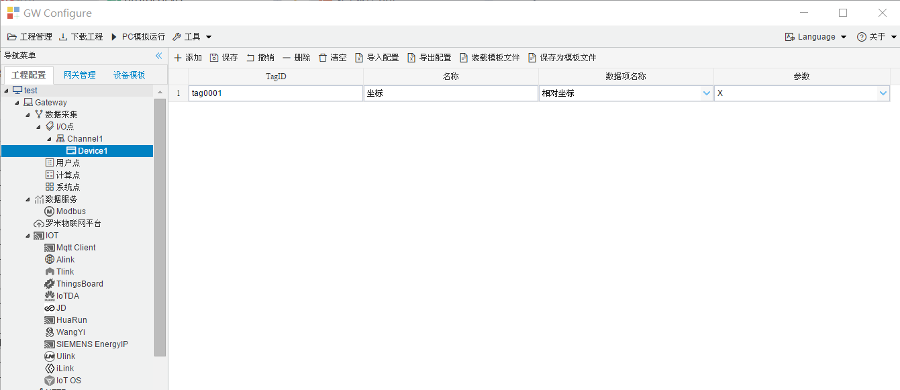

## 4.编辑采集点表

点击"Device1"，出现采集点配置界面，

- TagID：可自定义，默认为  tag0001，根据需要修改，设备采集点表内，名称不可重复；
- 名称：可自定义，描述信息，根据需要填写，可不填；
- 数据项名称：选择需要采集的数据项。
- 参数：选择X，Y，Z。

如下图2-1-7 所示  点击"添加" 后，创建如下内容，最后点击"保存"。

​		

图2-1-7 tag点配置

