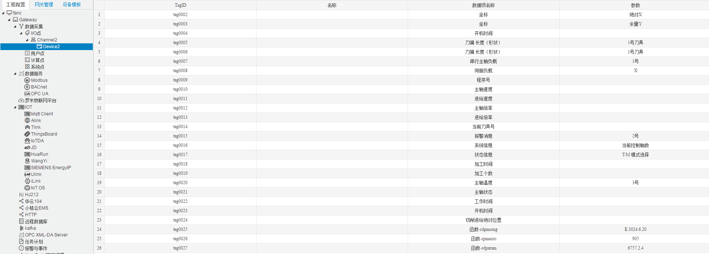
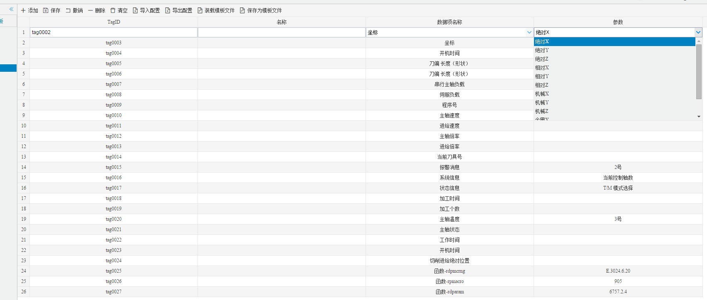

## 4.编辑采集点表

点击"Device1"，出现采集点配置界面，

- TagID：可自定义，默认为  tag0001，根据需要修改，设备采集点表内，名称不可重复；
- 名称：可自定义，描述信息，根据需要填写，可不填；
- 数据项名称：选择需要采集的数据项。
- 参数：根据"数据项名称"选择对应的参数项。

如下图2-1-7 所示  点击"添加" 后，创建如下内容，最后点击"保存"。

图2-1-7 tag点配置

**自定义函数功能：**

|   函数   | 说明                                                         |
| :------: | :----------------------------------------------------------- |
| rpmacro  | 宏变量 函数cnc_rdmacro，参数里面只有一个数字。               |
| rdparam  | 参数格式为"number.axis.length"，其中length的值只能为1/2/4这三者之一，调用的是cnc_rdparam函数。 |
| rdpmcrng | 参数格式为 "Area.StartAddress.DataType.XXX"。 其中Area为区域标识, 为：{ 'G', 'F', 'Y', 'X', 'A', 'R', 'T', 'K', 'C', 'D', 'M', 'N', 'E', 'Z' }的一个。 StartAddress为起始地址，只能是数字；  DataType为数据类型：         0—byte            后面如果有参数就是代表取位范围[0,7] 　　　　如"E.3024.0.6"代表E区域3024起始地址的该字节取第七位的值。 　　　　如"E.3024.0"代表E区域3024该地址字节的值。         1—short           如"E.3024.1"代表E区域3024起始地址的的2个字节组成的short值。          2—int32           如"E.3024.2"代表E区域3024起始地址的的4个字节组成的int32值。          4—float32        如"E.3024.4"代表E区域3024起始地址的的4个字节组成的float32值。          5—float64        如"E.3024.5"代表E区域3024起始地址的的8个字节组成的float64值。          6—byte Array  如"E.3024.6.20"代表E区域3024起始地址的的20个字节组成的字符串值。 |

