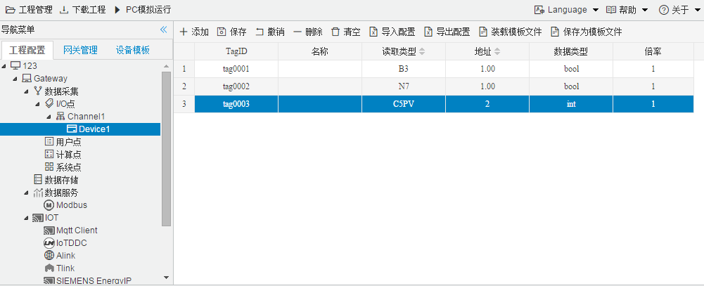

## 4.编辑采集点表

点击"Device1"，出现采集点配置界面，

- 名称：可自定义，默认为  tag0001，根据需要修改，设备采集点表内，名称不可重复；

- 描述：可自定义，描述信息，根据需要填写，可不填；

- 读取类型：根据需要，选择需要的数据寄存器；

  - 读取类型种类：B3、B10、B11、B12、B13、O0、I1、T4SV、T4PV、C5SV、C5PV、F8

    ​							N7、N10-N21；

    B3、B10、B11、B12、B13、O0、I1 数据类型只能为bool；

    T4SV、T4PV、C5SV、C5PV、F8、N7、N10-N21 可以为可选的任意类型；

- 地址：可自定义，数据寄存器的地址；

  当数据类型为bool时 ,地址后保留两位小数

- 数据类型：根据需要，选择读取的数据类型；

  - 数据类型种类：bool、short、ushort、int、uint、float

- 倍率：通过放大或者缩小数据，可进行工程上的换算。根据需要填写，默认为1；

- 注意：

  1. 当读取类型是"bool"时，**地址必须保留两位小数并且小数点后两位大于等于0且小于等于15**，**0-7为第1个字节  8-15位第2个字节**；

     例如:

     ​	地址为"1.01"  读取字节地址为 1 上第1位  bit，取出的值为0；

     ​	地址为"1.12"  读取字节地址为 1 上第12位  bit，取出的值为1；

     ​	**地址为"X.AB" 读取字节地址为'X'，"X.AB"最小为 "X.00",最大为"X.15"**

     

  2. 填入地址时，请注意数据寄存器的地址范围，详细请参见PLC文档。

  3. 每种数据寄存器的读写属性不完全一致，"I"数据寄存器只能读。

如下图5-8-7 所示  点击"添加" 后，创建两个tag点，最后点击"保存"；

1. "tag0001"，"读取类型"："B3"；"地址"："1.00"；"数型"："bool"；"倍率"："1"的采集点
2. "tag0002"，"读取类型"："N7"；"地址"："1.00"(读取数据区是"S"区,地址"1"上的第 "0"个比特 位作为返回结果)；"数据类型"："bool"；"倍率"："1“的采集点
3. "tag0003"，"读取类型"："C5PV"；"地址"："2；"数据类型"："int"；"倍率"："1“的采集点

​					

图5-8-7 tag点配置

