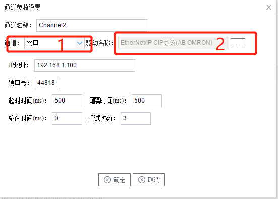

## 2.新建驱动

通道参数设置页面，在"通道"选择"串口"，在"驱动名称" 选中"EtherNet/IP CIP协议(AB OMRON)"。如下图5-9-2所示

  图5-9-2 选择驱动	

接着开始配置通道的采集信息，"EtherNet/IP CIP协议(AB OMRON)"默认配置是：

- 通道名称：Channel1，可自定义，不可重复，定义网关的采集通道；
- 通道：网口和串口两个选项，该驱动选择网口；
- 驱动名称： 选中"EtherNet/IP CIP协议(AB OMRON)"
- IP地址：填写仪表的IP地址，默认为192.168.1.100；
- 端口号：仪表的端口号，默认为44818；
- 超时时间：自定义，默认500ms; 
- 间隔时间：可自定义，默认500ms;
- 轮询时间：可自定义，默认为0ms;
- 重试次数：可自定义，默认为3;

点击"确定"后，菜单栏"I/O点"下会新增通道"Channel1"，如下图5-9-3所示

 图5-9-3 Channel子菜单栏

