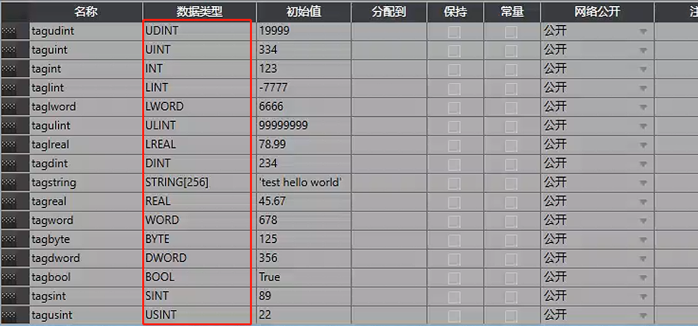
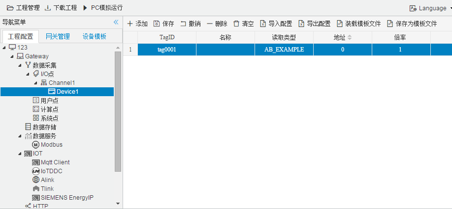

## 4.编辑采集点表

点击"Device1"，出现采集点配置界面，

- 名称：可自定义，默认为  tag0001，根据需要修改，设备采集点表内，名称不可重复；

- 描述：可自定义，描述信息，根据需要填写，可不填；

- 读取类型：根据需要，输入寄存器的名称；

- 地址：AB中的地址里的含义是 偏移位置，默认 填入 0 即可；

  当数据类型为bool时 ,地址后保留两位小数

- 数据类型：根据需要，选择读取的数据类型；

  - 数据类型种类：UDINT、UINT、INT、LINT、LWORD、ULINT、LREAL、DINT、STRING[256]、REAL、WORD、BYTE、DWORD、BOOL、SINT、USINT
  - 

- 倍率：通过放大或者缩小数据，可进行工程上的换算。根据需要填写，默认为1；

- 注意：

  2. 填入地址时，请注意数据寄存器的地址范围，详细请参见PLC文档。

  3. 每种数据寄存器的读写属性不完全一致，"I"数据寄存器只能读。

如下图5-9-7 所示  点击"添加" 后，创建两个tag点，最后点击"保存"；

1. "tag0001"，"读取类型"："AB_EXAMPLE"；"地址"："0"；"数型"："string"；"倍率"："1"的采集点

​					

图5-9-7 tag点配置

