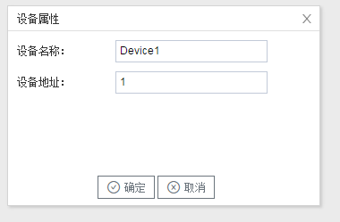

## 3.新建设备

右键"Channel1"后,如下图5-12-4所示   

图5-12-4 新建设备

点击"新建设备"，出现设备属性界面。

如下图5-12-5所示

- "设备名称"：可自定义，默认为"Device1"，同一通道下，设备名称不可重复。
- "设备地址"：填入PLC站号

配置完成后，"Channel1"下会多出一个新增设备”Device1“，如下图5-12-6所示。

图5-12-6 Device1 子菜单栏

