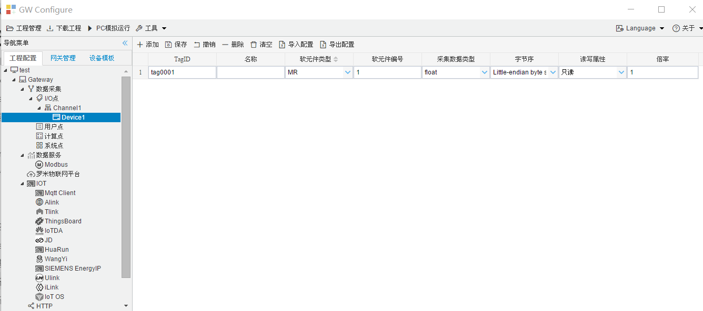

## 4.编辑采集点表

点击"Device1"，出现采集点配置界面，

- TagID：可自定义，默认为  tag0001，根据需要修改，设备采集点表内，名称不可重复；
- 名称：可自定义，描述信息，根据需要填写，可不填；
- 软元件类型：采集点的类型MR或DM；
- 软元件编号：采集点的编号；
- 采集数据类型：采集点数据类型；

- 数据类型：根据需要，选择读取的数据类型；

  - 数据类型种类：bool、short、ushort、int、uint、float、double、int64、uint64等。

- 字节序：计算机体系结构中对于字节、字等的存储机制不同，所以需要对高低字节排序，用来解析数据。

  我们用1、2、3、4 对应两个寄存器中的4个字节：

  - "Big-endian"表示高地址在前   1234
  - "Little-endian"表示低地址在前 4321
  - "Big-endian byte swap"表示高地址在前，并交换字节顺序   2143
  - "Little-endian byte swap"表示低地址在前，并交换字节顺序  3412

- 读写属性：指定采集点的读写权限，一般有"读写"（可读可写）、"只读"（只能读取）和"只写"（只能写入）

- "倍率"：通过倍率对数据进行乘法运算，可进行工程上的换算，默认为1。

如下图5-12-7所示  点击"添加" 后，创建了多个tag点，最后点击"保存"；

​					
