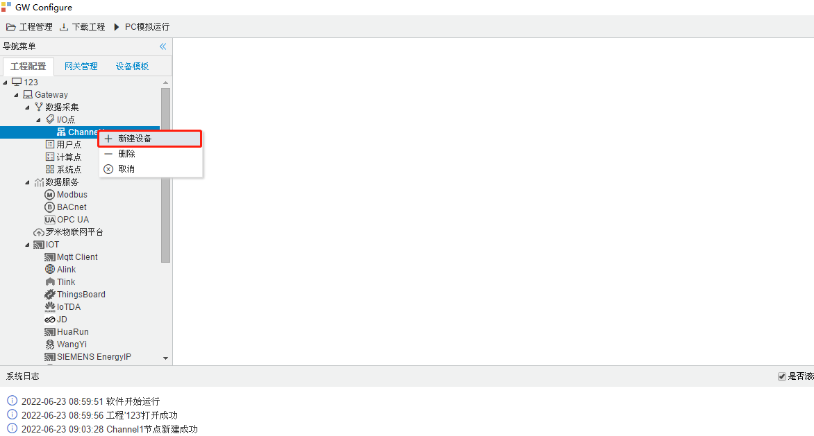

## 3.新建设备

右键"Channel1"后,如下图5-1-4所示   

图5-1-4 新建设备

点击"新建设备"，出现设备属性界面。

如下图5-1-5所示

图5-1-5  设备配置

- 设备名称：设备名称：可自定义，默认为"Device1"，同一通道下，设备名称不可重复。
- 设备地址：可自定义。

配置完成后，"Channel1"下会多出一个新增设备"Device1"，如下图5-1-6所示。

图5-1-6 Device1 子菜单栏

