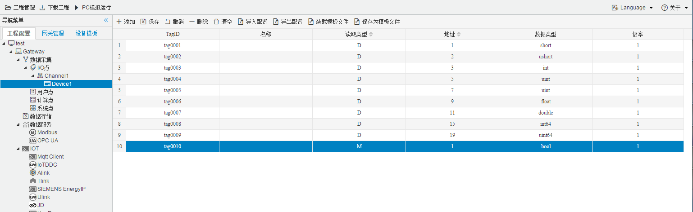

## 4.编辑采集点表

点击"Device1"，出现采集点配置界面，

- 名称：可自定义，默认为  tag0001，根据需要修改，设备采集点表内，名称不可重复；
- 描述：可自定义，描述信息，根据需要填写，可不填；
- 读取类型：根据需要，选择需要的数据寄存器；
  
  - 数据寄存器有 D,T,C,M,S,Y,X
- 地址：可自定义，数据寄存器的地址；
  

| 寄存器类型 | 位操作 | 字节操作 | 寄存器地址示例 |
| ---------- | ------ | -------- | -------------- |
| D          | √      | √        | 100            |
| T          | √      | √        | 100            |
| C          | √      | √        | 100            |
| M          | √      | √        | 100            |
| S          | √      | √        | 100            |
| Y          | √      | √        | 100            |
| X          | √      | √        | 100            |

- 数据类型：根据需要，选择需要的读取的数据类型；

  - 数据类型种类：bool、short、ushort、int、uint、float

**注意：**

  1. 当读取类型是"bool"时，**地址必须保留两位小数并且小数点后两位大于等于0且小于等于15**，**0-7为第1个字节  8-15位第2个字节**；

     例如:

     ​	地址为"1.01"  读取字节地址为 1 上第1位  bit，取出的值为0；

     ​	地址为"1.12"  读取字节地址为 1 上第12位  bit，取出的值为1；

     ​	**地址为"X.AB" 读取字节地址为'X'，"X.AB"最小为 "X.00",最大为"X.15"**

     

  2. 面对不同的寄存器的时候，地址范围不同，根据实际填写；

如下图5-1-7 所示  点击"添加" 后，创建了多个任务点，最后点击"保存"。

​					

图5-1-7 tag点配置

