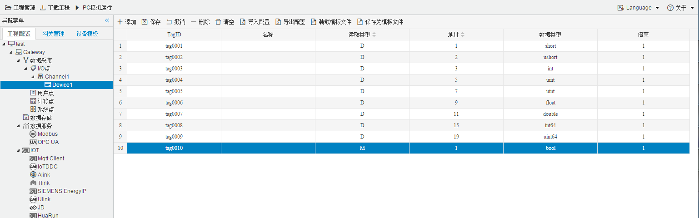

## 4.编辑采集点表

点击"Device1"，出现采集点配置界面，

- 名称：可自定义，默认为  tag0001，根据需要修改，设备采集点表内，名称不可重复；
- 描述：可自定义，描述信息，根据需要填写，可不填；
- 读取类型：根据需要，选择需要的数据寄存器；
  
  - 数据寄存器有 D,T,C,M,S,Y,X
- 地址：可自定义，数据寄存器的地址；
  

| 寄存器类型 | 位操作 | 字节操作 | 寄存器地址示例 |
| ---------- | ------ | -------- | -------------- |
| D          | x      | √        | 100            |
| T          | √      | ×        | 100            |
| C          | √      | ×        | 100            |
| M          | √      | ×        | 100            |
| S          | √      | ×        | 100            |
| Y          | √      | ×        | 100            |
| X          | √      | ×        | 100            |

- 数据类型：根据需要，选择需要的读取的数据类型；

  - 数据类型种类：bool、short、ushort、int、uint、float
  - D寄存器配置 short、ushort、int、uint、float
  - T,C,M,S,Y,X寄存器配置bool

**注意：**

  1. 当"读取类型"是"D"时，"数据类型"不能为"bool";当"读取类型"**不为**"D"时，"数据类型"**只能**为"bool"；
  2. 面对不同的寄存器的时候，地址范围不同，根据实际填写；

如下图5-1-7 所示  点击"添加" 后，创建了多个任务点，最后点击"保存"。

​					

图5-1-7 tag点配置

