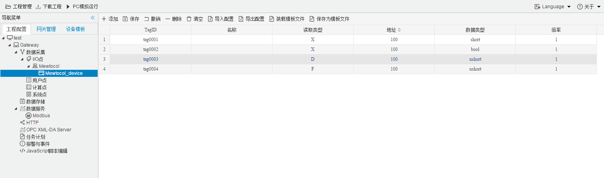

## 4.编辑采集点表

点击"Device1"，出现采集点配置界面，

- 名称：可自定义，默认为  tag0001，根据需要修改，设备采集点表内，名称不可重复；

- 描述：可自定义，描述信息，根据需要填写，可不填；

- 读取类型：根据需要，选择需要的数据寄存器；
  
  - 读取类型种类：X、Y、R、L、D、F、T、C、IX、IY
  
- 地址：可自定义，数据寄存器的地址；

- 数据类型：bool、short、ushort、int、uint、float、double、int64、uint64

| 寄存器类型 | 位操作 | 字节操作 | 寄存器地址示例               |
| ---------- | ------ | -------- | ---------------------------- |
| X          | √      | √        | 100.01(位操作) 100(字节操作) |
| Y          | √      | √        | 100.01(位操作) 100(字节操作) |
| R          | √      | √        | 100.01(位操作) 100(字节操作) |
| L          | √      | √        | 100.01(位操作) 100(字节操作) |
| D          | x      | √        | 100(字节操作)                |
| F          | x      | √        | 100(字节操作)                |
| T          | x      | √        | 100(字节操作)                |
| C          | x      | √        | 100(字节操作)                |
| IX         | x      | √        | 100(字节操作)                |
| IY         | x      | √        | 100(字节操作)                |

- 倍率：通过放大或者缩小数据，可进行工程上的换算。根据需要填写，默认为1；

如下图5-12-7所示  点击"添加" 后，创建了多个tag点，最后点击"保存"；

​					

图5-12-7 tag点配置

