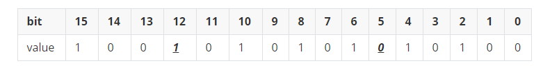
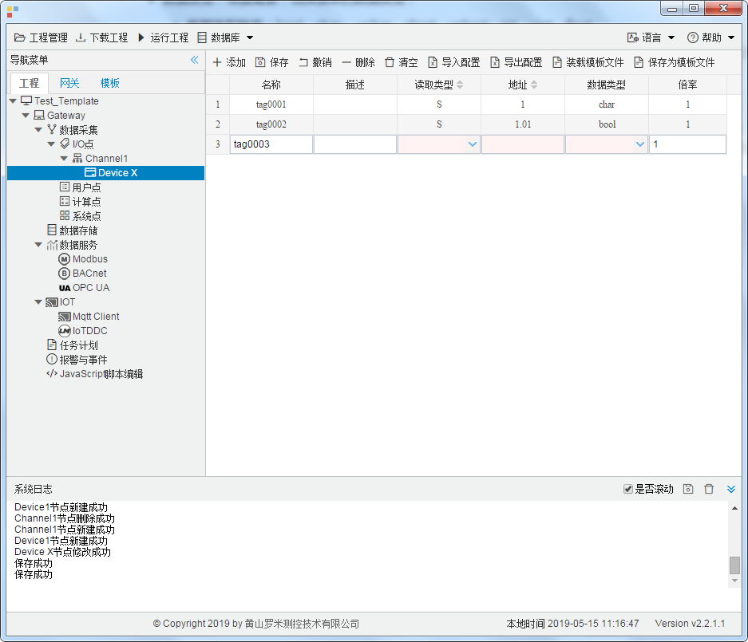

## 4.编辑采集点表

点击"Device1"，出现采集点配置界面，

- 名称：可自定义，默认为  tag0001，根据需要修改，设备采集点表内，名称不可重复；

- 描述：可自定义，描述信息，根据需要填写，可不填；

- 读取类型：根据需要，选择需要的数据寄存器；
  
  - 读取类型种类：S、SM、I、Q、M、V、T、C
  
- 地址：可自定义，数据寄存器的地址；

- 数据类型：根据需要，选择读取的数据类型；
  
  - 数据类型种类：bool、char 、uchar、short、ushort、int、uint、float
  
- 倍率：通过放大或者缩小数据，可进行工程上的换算。根据需要填写，默认为1；

- 注意：
  
  1. 当读取类型是"bool"时，地址必须保留两位小数，例如：0-7为第1个字节  8-15位第2个字节
  
     地址为"1.05"  读取字节地址为 1 上第5位  bit，取出的值为0；
  
     地址为"1.12"  读取字节地址为 1 上第12位  bit，取出的值为1；
  
     
     
  2. 填入地址时，请注意数据寄存器的地址范围，详细请参见PLC文档。
  
  3. 每种数据寄存器的读写属性不完全一致，"I"数据寄存器只能读。
  

如下图5-2-7 所示  点击"添加" 后，创建两个tag点，最后点击"保存"；

1. "tag0001"，"读取类型"："S"；"地址"："1"；"数型"："char"；"倍率"："1"的采集点
2. "tag0002"，"读取类型"："S"；"地址"："1.01"(读取数据区是"S"区,地址"1"上的第 "1"个比特 位作为返回结果)；"数据类型"："bool"；"倍率"："1“的采集点

​					

图5-2-7 tag点配置

