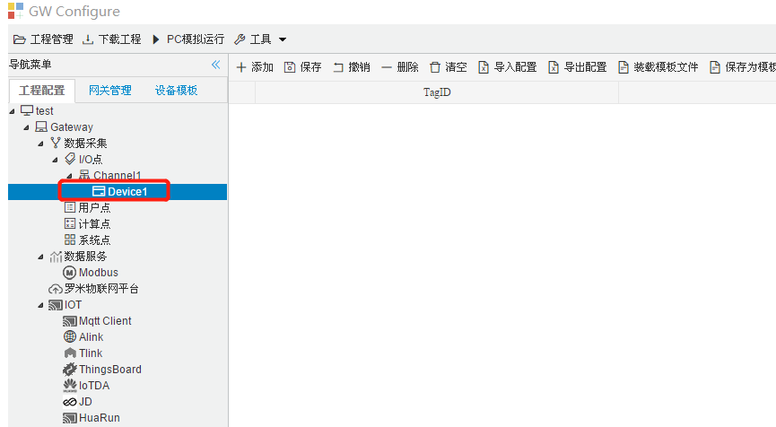

## 3.新建设备

右键"Channel1"后,如下图5-7-4所示   

图5-7-4 新建设备

点击"新建设备"，出现设备属性界面。

如下图5-7-5所示

图5-7-5 设备配置

- "设备ID"：可自定义，默认为"Device1"，同一通道下，设备ID不可重复。
- "设备名称"：可自定义，可不填。
- "TSAP(PLC)"   ：包含连接资源、槽号、机架号信息。和PLC配置的Local TSAP保持一致，具体值请咨询PLC配置工程师
- "TSAP(PC)"     ：包含连接资源、槽号、机架号信息。和PLC配置的Dest TSAP保持一致，具体值请咨询PLC配置工程师

配置完成后，"Channel1"下会多出一个新增设备”Device1“，如下图5-7-6所示。

图5-7-6 Device1 子菜单栏

