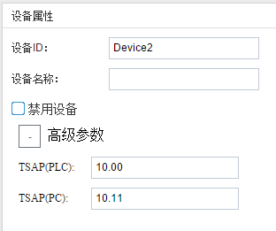

## 3.新建设备

右键"Channel1"后,如下图5-2-4所示   

图5-2-4 新建设备

点击"新建设备"，出现设备属性弹框。

如下图5-2-5所示

图5-2-5 设备配置

- "设备名称" ：可自定义，默认为"Device1"，同一通道下，设备名称不可重复。

- "TSAP(PLC)"   ：第一字节是连接数，第二个字节是机架号和cpu的槽号

- "TSAP(PC)"     ：第一字节是连接数，第二个字节填写00即可

  **当PLC设备类型为 200-smart时，TSAP可不用填写，默认即可**

配置完成后，"Channel1"下会多出一个新增设备”Device1“，如下图5-2-6所示。

图5-2-6 Device1 子菜单栏

