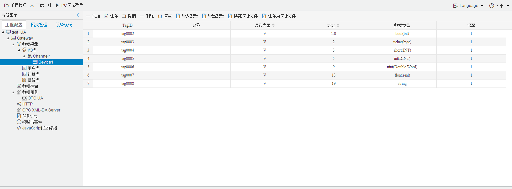

## 4.编辑采集点表

点击"Device1"，出现采集点配置界面，

- 名称：可自定义，默认为  tag0001，根据需要修改，设备采集点表内，名称不可重复；
- 描述：可自定义，描述信息，根据需要填写，可不填；
- 读取类型：根据需要，选择需要的数据寄存器；
  
  - 读取类型种类：S、SM、I、Q、M、V、T、C
- 地址：可自定义，数据寄存器的地址；

当数据类型为 bool(bit) 为位操作；其他数据类形时，为字节操作。

| 寄存器类型 | 位操作 | 字节操作 | 寄存器地址示例                 |
| ---------- | ------ | -------- | ------------------------------ |
| I          | √      | √        | 10.1（位操作）  11（字节操作） |
| Q          | √      | √        | 10.1（位操作）  11（字节操作） |
| M          | √      | √        | 10.1（位操作）  11（字节操作） |
| T          | √      | √        | 10.1（位操作）  11（字节操作） |
| C          | √      | √        | 10.1（位操作）  11（字节操作） |
| V          | √      | √        | 10.1（位操作）  11（字节操作） |
| S          | √      | √        | 10.1（位操作）  11（字节操作） |
| SM         | √      | √        | 10.1（位操作）  11（字节操作） |

- 数据类型：根据需要，选择读取的数据类型；
  
  - 数据类型种类：bool(bit)、uchar(byte)、short(INT)、ushort(Word)、int(DINT)、uint(Double Word)、float(real)、string   括号内为 PLC编程类型
  
- 倍率：通过放大或者缩小数据，可进行工程上的换算。根据需要填写，默认为1；

- 注意：
  
  1. 当读取类型是"bool"时，**地址必须为X.A的形式，并且   0≤A≤7**
  
     例如:
  
     ​	地址为"1.0"  读取字节地址为 1 上第0位  bit，取出的值为0；
  
     ​	地址为"1.2"  读取字节地址为 1 上第2位  bit，取出的值为1；
     
     ​	**地址为"X.A" 读取字节地址为'X'，"X.A"最小为 "X.0",最大为"X.7"**
     
     
     
     读取类型为其他类型时，例如：uchar(byte)、short(INT)、ushort(Word)、int(DINT)、uint(Double Word)、float(real)，填写地址整数位即可，如下图所示；
     
  2. 填入地址时，请注意数据寄存器的地址范围，详细请参见PLC文档。
  
  3. 每种数据寄存器的读写属性不完全一致，"I"数据寄存器只能读。
  

如下图5-2-7 所示  点击"添加" 后，创建了多个tag点，最后点击"保存"；

​					

图5-2-7 tag点配置

