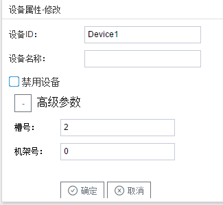

## 3.新建设备

右键"Channel1"后,如下图5-5-4所示   

图5-5-4 新建设备

点击"新建设备"，出现设备属性界面。

如下图5-5-5所示

图5-5-5 设备配置

- "设备ID"：可自定义，默认为"Device1"，同一通道下，设备ID不可重复。
- "设备名称"：可自定义，可不填。
- "槽号"         ：分配各个模块在机架上的具体位置，必填
- "机架号"     ：安装CPU的机架为主机架为0，扩展的机架编号依次为1号机架、2号机架，必填

配置完成后，"Channel1"下会多出一个新增设备”Device1“，如下图5-5-6所示。

图5-5-6 Device1 子菜单栏

