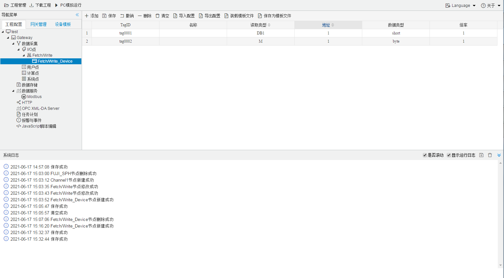

## 4.编辑采集点表

点击"Device1"，出现采集点配置界面，

- 名称：可自定义，默认为  tag0001，根据需要修改，设备采集点表内，名称不可重复；

- 描述：可自定义，描述信息，根据需要填写，可不填；

- 读取类型：根据需要，选择需要的数据寄存器；
  
  - 读取类型种类：S、SM、I、Q、M、T、C、DB1、DB2...DBn 。
  
- 地址：可自定义，数据寄存器的地址；

- 数据类型：根据需要，选择读取的数据类型；
  
  - 数据类型种类：bool(bit)、uchar(byte)、short(INT)、ushort(Word)、int(DINT)、uint(Double Word)、float(real)、string   括号内为 PLC编程类型

| 寄存器类型    | 位操作 | 字节操作 | 寄存器地址示例 |
| ------------- | ------ | -------- | -------------- |
| I             | ×      | √        | 11（字节操作） |
| Q             | ×      | √        | 11（字节操作） |
| M             | ×      | √        | 11（字节操作） |
| T             | ×      | √        | 11（字节操作） |
| C             | ×      | √        | 11（字节操作） |
| DBn(1,2,3...) | ×      | √        | 11（双字操作） |
| V             | ×      | √        | 11（字节操作） |
| S             | ×      | √        | 11（字节操作） |
| SM            | ×      | √        | 11（字节操作） |
  
- 倍率：通过放大或者缩小数据，可进行工程上的换算。根据需要填写，默认为1；

如下图5-2-7 所示  点击"添加" 后，创建了多个tag点，最后点击"保存"；

​					

图5-5-7 tag点配置

