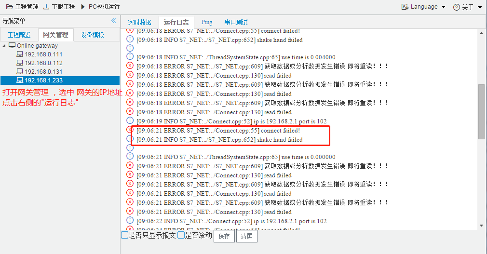
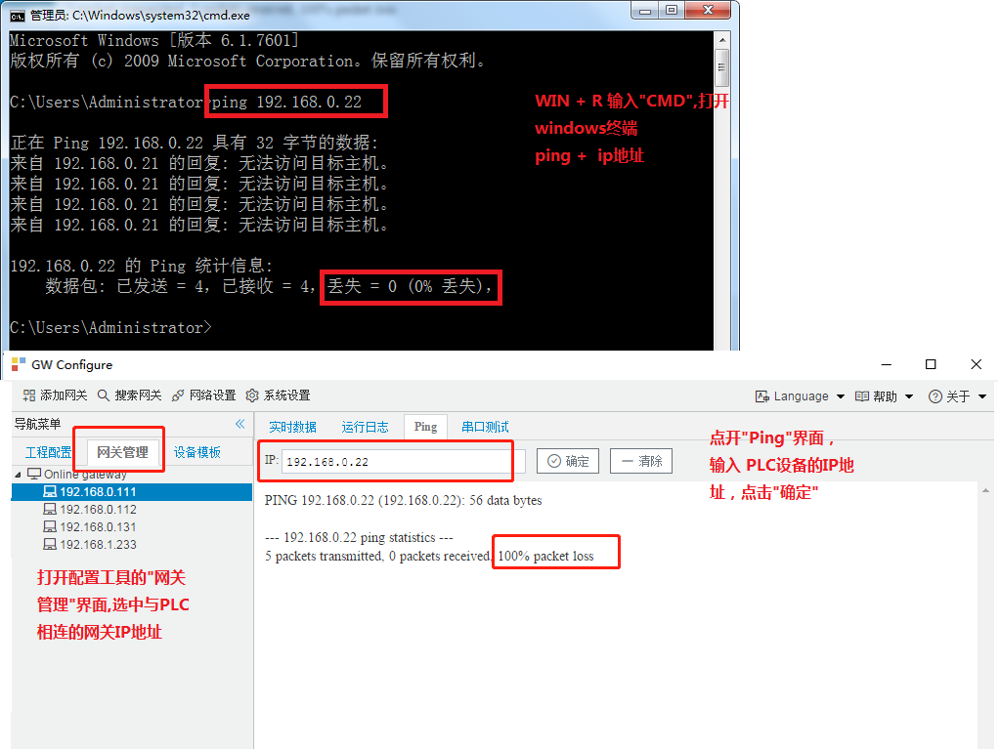
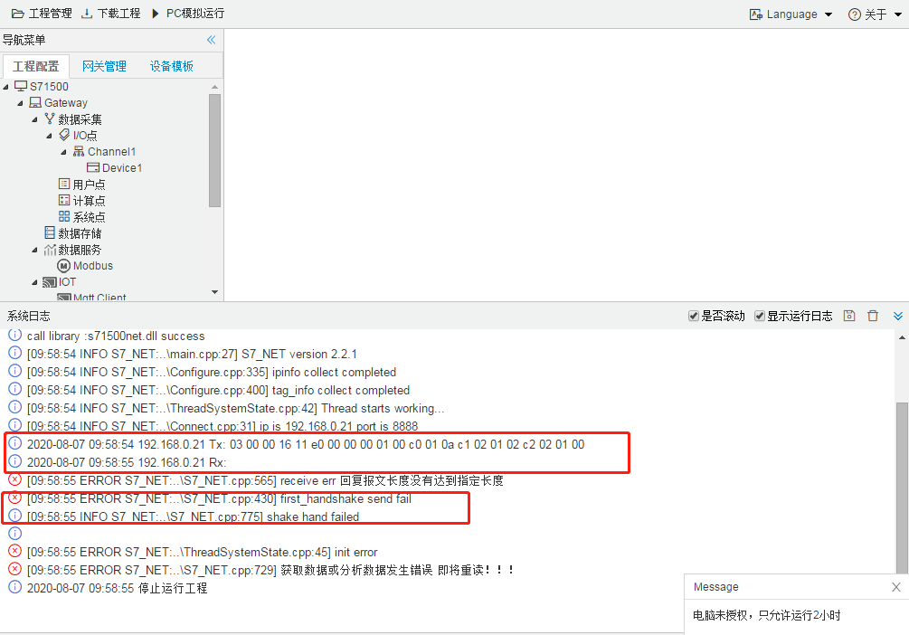
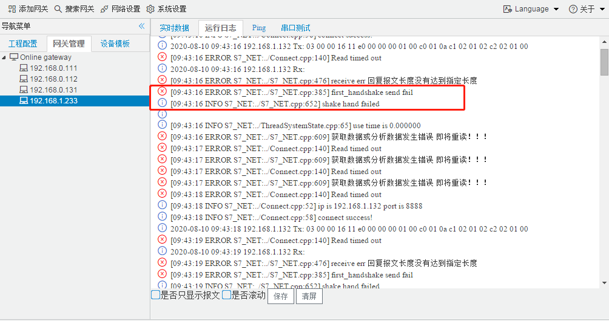
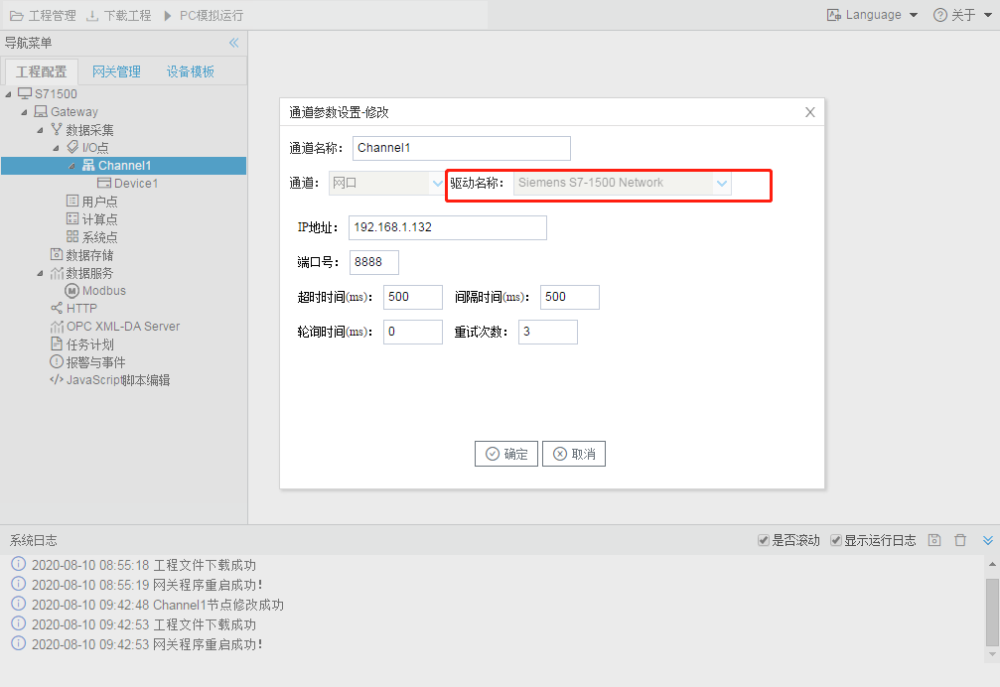
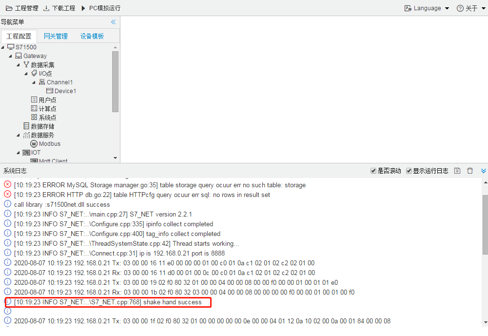
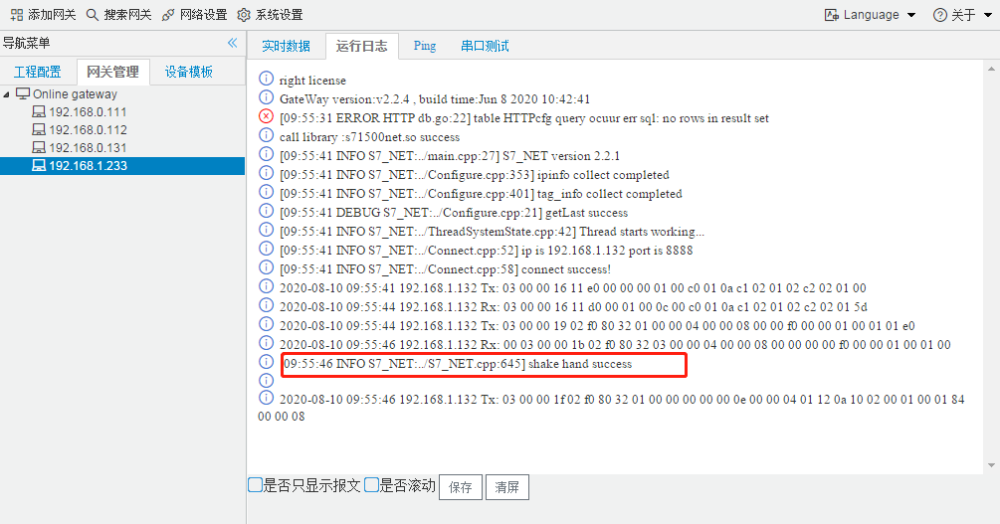
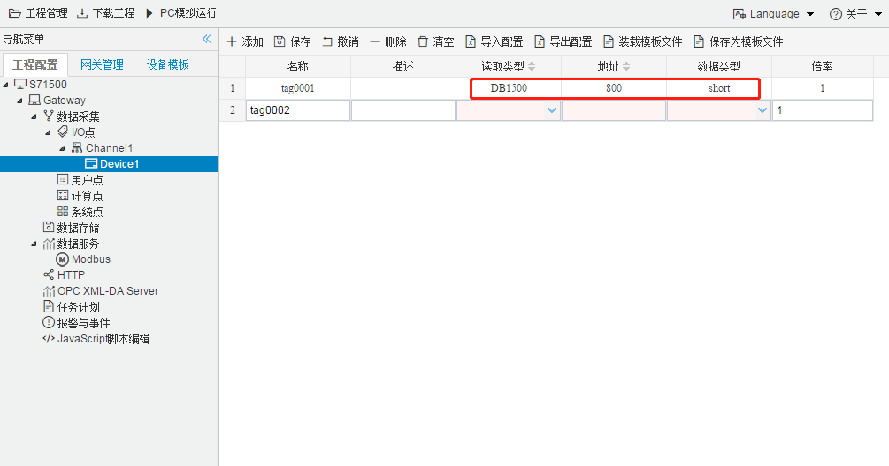

## 网关连接西门子PLC

文档搭建了两个测试环境 ，一个是使用配置工具运行工程，另一个是将工程下载到硬件网关中运行。列出了在配置过程中的最常出现的三种问题：连接出错、握手失败以及PUT/GET通信访问未设置。在文档的最后列出了西门子PLC各种数据类型的配置。

#### 1.连接出错

配置工具连接出错

网关连接出错

配置工具出现**无法发出报文，出现"connect err"**或者运行日志中出现**"connect failed!"**

无法ping通PLC设备

检查计算机与PLC设备之间的网络线路 或者 IP地址是否设置正确

ping通PLC设备

配置工具或者网关能够ping通网关，则应该检查端口号是否设置正确。

#### 2.握手失败

配置工具握手失败

网关握手失败

**报文能够正常发，但出现”first_handshake send fail“的错误时：**

1. 检查驱动是否选择正确。

   

   
驱动选择

2. 检查槽号机架号是否选择正确  如果槽号机架号未知，可咨询PLC设备的供应商或厂家。

   

   
槽号与机架号

   配置完成后，重新下载至网关

#### 3.PUT/GET通信访问未设置

配置工具握手成功

网关握手成功

**出现"shake hand successs"握手成功，但还是无法从PLC设备获得数据**

- 在PLC设备上 设置  ["允许从远程伙伴 (PLC、HMI、OPC、...)使用PUT/GET通信访问"](https://wenku.baidu.com/view/ff5c9e564b7302768e9951e79b89680202d86b57.html )；

图-PUTGET操作

### PLC数据类型及数据转换

| PLC数据类型         | 配置的数据类型 |
| ------------------- | -------------- |
| 位（bit）           | bool           |
| 字节（byte）        | char/uchar     |
| 字（Word）          | ushort         |
| 双字（Double Word） | uint           |
| 整数型（INT）       | short          |
| 双整数型（DINT）    | int            |
| 实数/浮点（real）   | float          |

### plc地址的转换

下列图片演示如何把PLC地址转换成页面的配置。

DB1500.800.0 编号1500的 分区为DB块，地址为800.0。数据类型为short（PLC中为INT）

地址DB1500.800.0 转换

I.50.1  分区为I，地址为50.1，因为数据类型为 bool（PLC中为bit），所以地址中填写 50.01

地址I.50.1 转换

