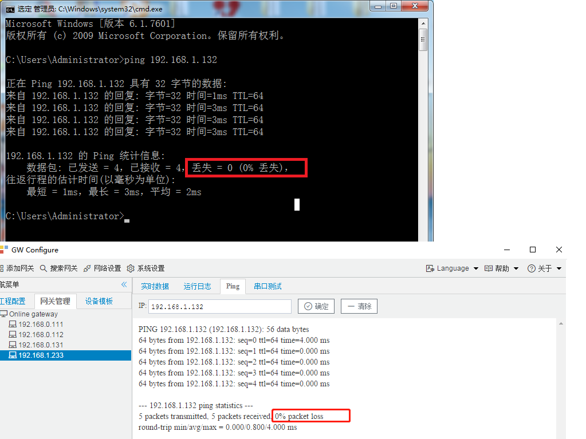

# 网关对于已支持plc连接说明

## 一.不同类型PLC，设备以及采集点表的配置

### 1基恩士PLC

基恩士的 KV-7500/7300、KV-5500/5000/3000、KV-Nano设备支持 MC(Binary)协议 

详细配置参考 [Mitsubishi MC_Qna3EBinary](./Mitsubishi/MC_Qna3EBinary/Mitsubishi_Qna3EBinary.md)

### 2松下PLC

松下PLC设备 也有支持  MC(Binary)协议

详细配置参考 [Mitsubishi MC_Qna3EBinary](./Mitsubishi/MC_Qna3EBinary/Mitsubishi_Qna3EBinary.md)

### 3欧姆龙PLC

欧姆龙部分 PLC支持 CIP协议

详细配置参考 [AB_NET](./Allen-Bradley/AB_NET/AB_NET.md)

## 二. plc连接说明

#### 1.1 连接问题

如何确定PLC能否被访问？

首先，使用ping命令来确认，如果能ping通，说明网络线路以及IP地址的设置是没有问题。

最后检查下端口号，是否填写错误。

ping通PLC设备

如果网络线路和端口号都没有问题，就需要通过编程软件来设置下plc设备。

#### 1.2  西门子PLC设置

##### 1.2.1 S7-1200 与 S7-1500 的设置

1.在PLC设备上 设置  ["允许从远程伙伴 (PLC、HMI、OPC、...)使用PUT/GET通信访问"](https://wenku.baidu.com/view/ff5c9e564b7302768e9951e79b89680202d86b57.html )；

2.访问DB模块的数据，关闭DB块优化访问

##### 1.2.2西门子plc无数据显示以及无报文返回

西门子设备与触摸屏或者采集网关连接有**最大数量8个**的限制。当网关采集不上数据时，可以关闭触摸屏或者其他采集设备，开放出PLC与网关的连接通道，网关才能采集到数据。

##### 1.2.3PLC数据类型及数据转换

| PLC数据类型         | 配置的数据类型 |
| ------------------- | -------------- |
| 位（bit）           | bool           |
| 字节（byte）        | char/uchar     |
| 字（Word）          | ushort         |
| 双字（Double Word） | uint           |
| 整数型（INT）       | short          |
| 双整数型（DINT）    | int            |
| 实数/浮点（real）   | float          |

#### 1.3 三菱PLC设置

PLC型号为Q06UDEH  编程软件：GX Works 

然后进"打开设置"，如下是按TCP协议开放了两个供上位机MC协议的端口。

 使用网络模块QJ71E71-100通讯

GX Works 软件打开"参数"-->>"网络参数"-->>"以太网..."配置IP，协议格式等参数。下图中的初始时间设置，允许RUN中写入一定要勾对

然后进"打开设置"，如下是按TCP协议开放了一个供上位机MC协议的端口3210

**说明：**

**为了使配置生效，需要在线修改后，对于PLC重新上电，才能生效（断电请保持7-10秒）**

