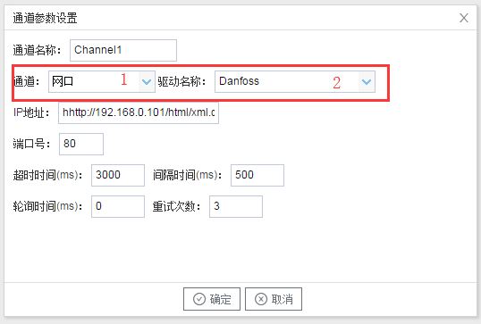

## 2.新建驱动

通道参数设置页面，在"通道"选择"网口"，在"驱动名称" 选中"Danfoss"。如下图4-1-2所示

  图4-1-2 通道参数设置

- 通道名称：Channel1，可自定义，不可重复，定义网关的采集通道；
- 通道：网口和串口两个选项，该驱动选择网口；
- 驱动名称： 选中"Danfoss"
- IP地址：填写仪表的IP地址，默认为http://192.168.0.101/html/xml.cgi；
- 端口号：仪表的端口号，默认为80； 
- 超时时间：自定义，默认3000ms；
- 间隔时间：可自定义，默认500ms；
- 轮询时间：可自定义，默认为0ms；
- 重试次数：可自定义，默认为3；

点击"确定"后，菜单栏"I/O点"下会新增通道"Channel1"，如下图4-1-3所示

 图4-1-3 Channel子菜单栏
