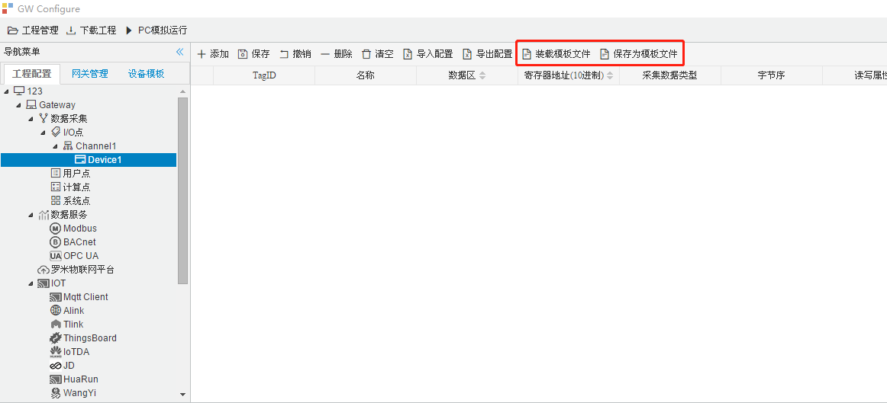
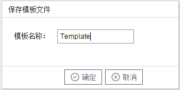
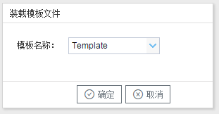

## 6.模板

在配置工具内，完成任务配置后，可将配置完成的数据采集点表另存为模板，可在其它页面或工程中装载使用。

如下图4-1-9所示

图4-1-9 模板文件

#### 1.保存模板文件

完成任务配置后，点击 “保存为模板文件” ，如下图4-1-10所示。

图4-1-10 模板界面

- 模板名称：可自定义，名称不可重复；

  完成后，点击"确定"

#### 2.装载模板文件

新建一个采集点配置页面，点击”装载模板文件“，选择 "Template"模板，就可以完成快速新建任务。

如下图4-1-11所示

图4-1-11 装载模板

