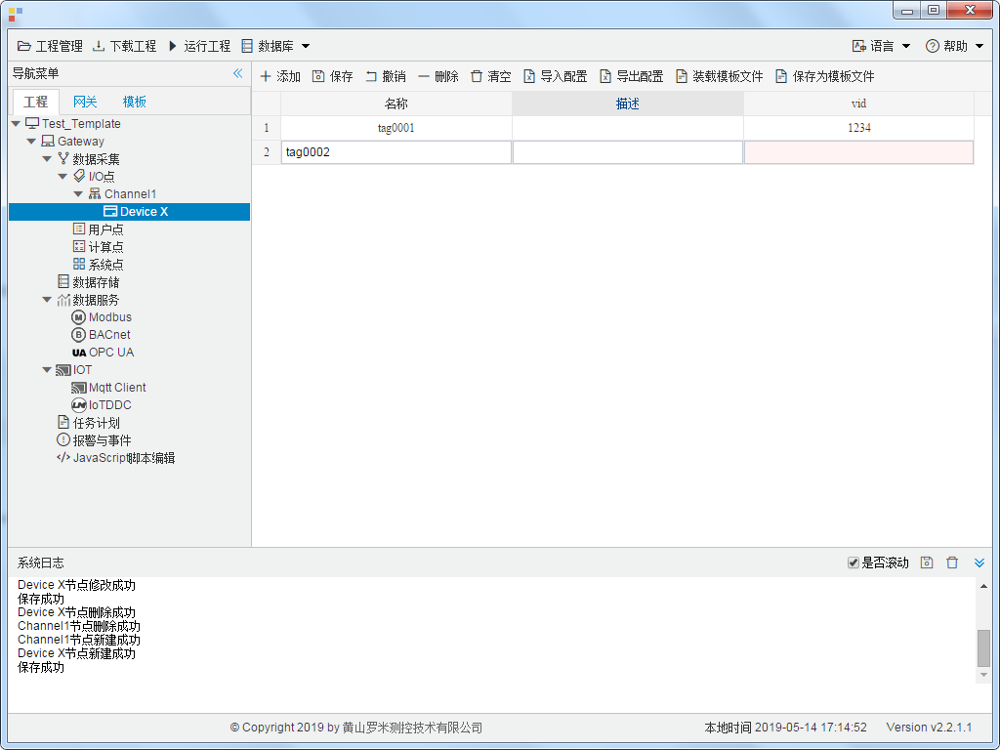

## 4.编辑采集点表

点击"Device1"，出现采集点配置界面，

- 名称：可自定义，默认为  tag0001，根据需要修改，设备采集点表内，名称不可重复；
- 描述：可自定义，描述信息，根据需要填写，可不填；
- vid：自定义，寄存器的地址，必填；

如下图4-1-7 所示  点击"添加" 后，创建名称为"tag0001"，"vid"1234的任务点, 最后点击"保存"。

​					

图4-1-7 tag点配置

