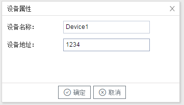

## 3.新建设备

右键"Channel1"后,如下图4-2-4所示   

图4-2-4 新建设备

点击"新建设备"，出现设备属性界面。

如下图4-2-5所示

图4-2-5  设备配置

- 设备名称：可自定义，默认为"Device1"，同一通道下，设备名称不可重复。
- 设备地址：热量表的通讯地址，也称为表号。标准协议定义通信地址为8位数字，**不足8位时，配置工具可在高位自动补”0“**。

配置完成后，"Channel1"下会多出一个新增设备”Device1“，如下图4-2-6所示。

图4-2-6 Device1 子菜单栏

