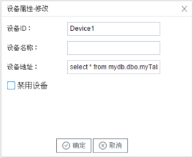

## 3.新建设备

右键"Channel1"后,如下图2-3-4所示   

点击"新建设备"，出现设备属性弹框。

如下图2-3-5所示

- 设备ID：可自定义，默认为"Device1"，同一通道下，设备名称不可重复。

- "设备名称"：可以自定义，设备的名称。

- "设备地址"：SQL语句，用于从SQLServer数据库中取数据。

  格式：数据库名.表名;  例如：DataName.TableName。<两层节点>
  
  查询脚本为SELECT * from <TableName>
  
  特殊格式：数据库名.表名.sql 语句;   例如：DataName.TableName.sql。<三层节点>
  
  如 sql= SELECT top 1*FROM tl ORDER BY XTimeStamp DESC
  
  则是以该 sql 脚本执行查询。
  
  

配置完成后，"Channel1"下会多出一个新增设备"Device1"，如下图2-3-6所示。

