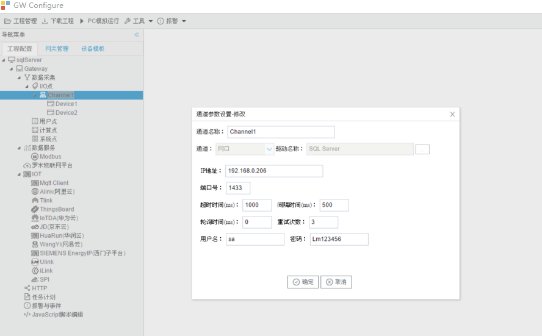

## 2.新建驱动

通道参数设置页面，在"通道"选择"串口"，在"驱动名称" 选中"CJ188"。如下图2-3-2所示

通道名称：Channel1，可自定义，不可重复，定义网关的采集通道；

- 通道：网口和串口两个选项，该驱动选择"网口"；
- "驱动名称"： 选中"SQL Server"
- IP地址：SQL Server服务端IP地址；
- 端口号：SQL Server服务端端口号，默认为1433；
- 超时时间：自定义，默认1000ms；
- 间隔时间：可自定义，默认500ms；
- 轮询时间：可自定义，默认为0ms；
- 重试次数：可自定义，默认为3；
- 用户名：SQL Server服务端登录的用户名；
- 密码：SQL Server服务端登录的密码；

点击"确定"后，菜单栏"I/O点"下会新增通道"Channel1"，如下图2-3-3所示

