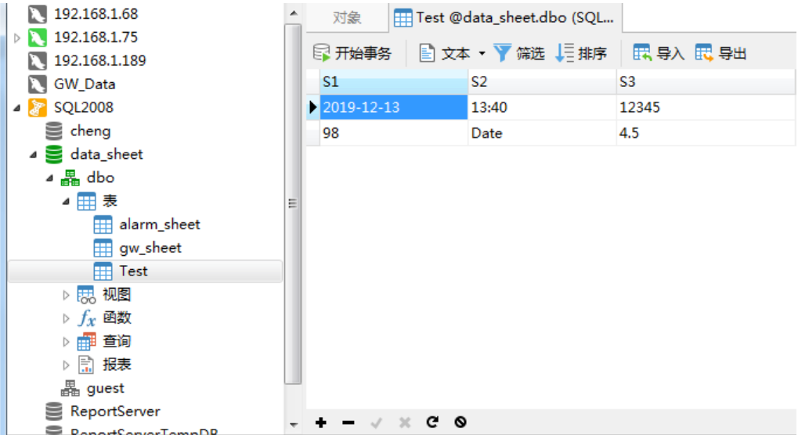
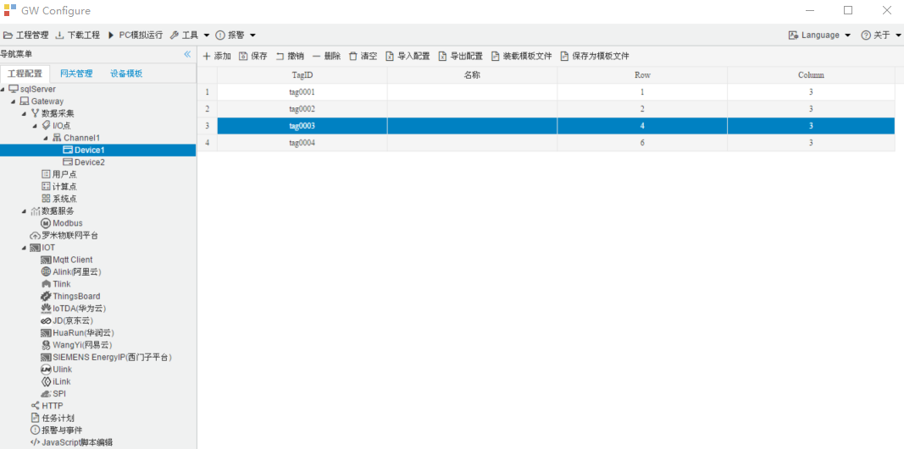

## 4.编辑采集点表

点击"Device1"，出现采集点配置界面，

- TagID：可自定义，默认为  tag0001，根据需要修改，设备采集点表内，名称不可重复；

- 名称：可自定义，描述信息，根据需要填写，可不填；

- Row：表示数据库表中的第几行;

- Column：表示数据库表中的第几列；

  例如：Row: 1,  Column：1，对应数据库表中的第一行第一列，如下图选中区域。

如下图2-3-7 所示  点击"添加" 后，创建采集点，最后点击"保存"。

