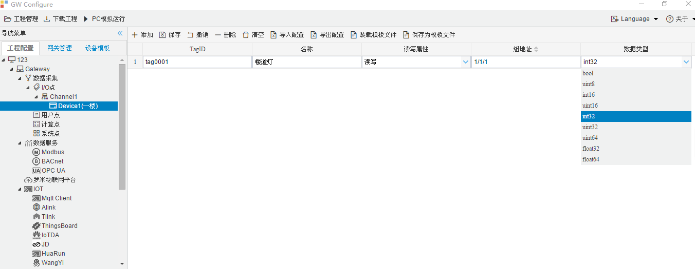

## 4.编辑采集点表

点击"Device1"，出现采集点配置界面，

- TagID：可自定义，默认为  tag0001，根据需要修改，设备采集点表内，名称不可重复；
- 名称：可自定义，描述信息，根据需要填写，可不填；
- 读写属性：根据需要，选择 **只读、只写、读写**选择其中之一 ；
- 组地址：可自定义，必须填写；
- 数据类型：根据需要选择一个数据类型；

如下图2-1-7 所示  点击"添加" 后，创建名称为"tag0001"，"名称"："楼道灯"；"读写属性"："读定"；"组地址"："1/1/1"；“数据类型”：“int32”，最后点击"保存"。

​		

图2-1-7 tag点配置

