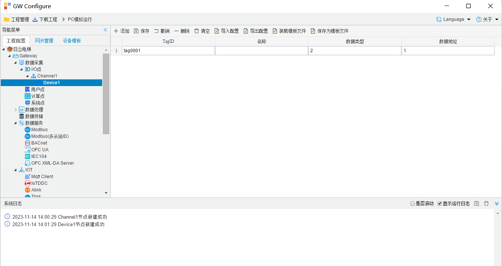
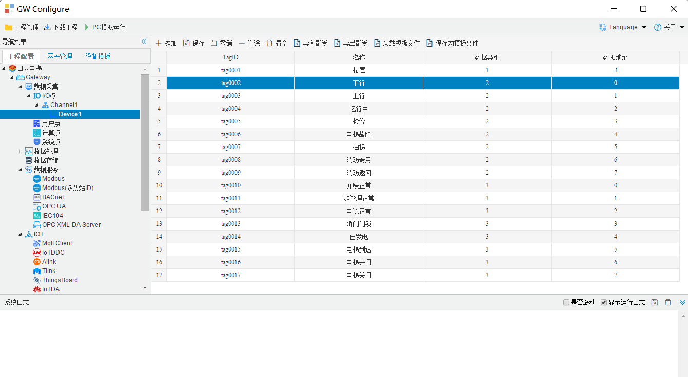
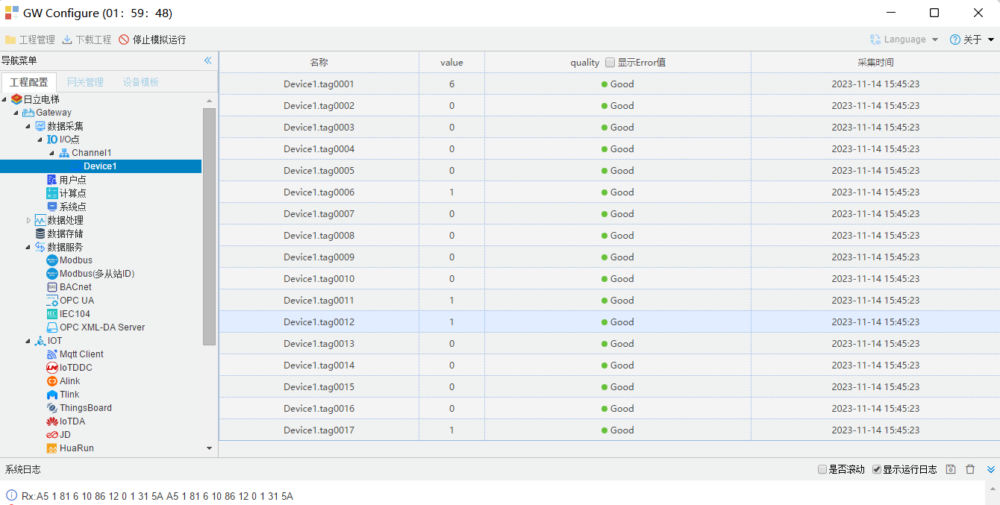

## 4.编辑采集点表

点击"Device1"，出现采集点配置界面，

- TagID：可自定义，默认为  tag0001，根据需要修改，设备采集点表内，名称不可重复；
- 名称：可自定义，描述信息，根据需要填写，可不填；
- 数据类型：根据需要填写如(1,2,3...) ，对应(**D1**,**D2**,**D3**...)数据区；
- 数据地址：根据数据类型，填写对应数据区的具体地址；

如下图2-2-7 所示  点击"添加" 后，创建名称为"tag0001"，"数据类型"："2"；"数据地址"："1"的任务点。

当前数据点表示"**电梯运行状态 I**"的"上行"**状态**。

最后点击"保存"。

​		

图2-2-7 tag点配置

如下图2-2-8 所示 配置点为协议中的详细点，参照下方D1-D6数据区点详情。

图2-2-8 tag点配置详情

下图2-2-89是pc模拟运行时采集到的数据点信息。

图2-2-9 数据点采集详情

D1-D6为电梯运行的数据

**楼层信息（D1 数据）**

| 数据地址 |         楼层         |
| :------: | :------------------: |
| -1(默认) | 采集到的值即对应楼层 |

**电梯运行状态 I（D2 数据）**

| 数据地址 |   内容   |         说明          |
| :------: | :------: | :-------------------: |
|    0     |   下行   |     为 1 表示下行     |
|    1     |   上行   |     为 1 表示上行     |
|    2     |  运行中  |  为 1 表示电梯运行中  |
|    3     |   检修   |    为 1 表示检修中    |
|    4     | 电梯故障 |   为 0 表示电梯故障   |
|    5     |   泊梯   |   为 1 表示电梯泊梯   |
|    6     | 消防专用 | 为 1 表示电梯消防专用 |
|    7     | 消防返回 | 为 1 表示电梯消防返回 |

**电梯运行状态 II（D3 数据）** 

| 数据地址 |    内容    |          说明           |
| :------: | :--------: | :---------------------: |
|    0     |  并联正常  |  为 1 表示电梯并联正常  |
|    1     | 群管理正常 |   为 1 表示群管理正常   |
|    2     |  电源正常  |  为 1 表示电梯电源正常  |
|    3     |  轿门门锁  |    为 1 表示轿门关闭    |
|    4     |   自发电   | 为 1 表示电梯自发电运行 |
|    5     |  电梯到达  |    为 1 表示电梯到达    |
|    6     |  电梯开门  |     为 1 表示开门中     |
|    7     |  电梯关门  |     为 1 表示关门中     |

**电梯运行状态 III（D4 数据）**

| 数据地址 |     内容     |           说明            |
| :------: | :----------: | :-----------------------: |
|    0     |   地震运行   |  为 1 时电梯地震管制运行  |
|    1     | 安全装置正常 |  为 1 时电梯安全装置正常  |
|    2     |   专用运行   |    为 1 时电梯专用运行    |
|    3     | 火灾管制运行 |   为 1 时电梯管制运行中   |
|    4     |   位于门区   |   为 1 时电梯位于门区中   |
|    5     |   自救运行   |   为 1 时电梯自救运行中   |
|    6     |   A2 故障    | 为 1 时电梯发生 A2 级故障 |
|    7     |   A1 故障    | 为 1 时电梯发生 A1 级故障 |

**电梯运行状态Ⅳ（D5 数据）(备用)**

**电梯运行状态Ⅴ（D6 数据）**

| 数据地址 |   内容   |        说明         |
| :------: | :------: | :-----------------: |
|    0     | 厅门门锁 |   为 1 时厅门关闭   |
|    1     |   抱闸   |   为 1 时抱闸打开   |
|    2     | 安全触板 | 为 1 时安全触板动作 |
|    3     | 光电保护 | 为 1 时光电保护动作 |
|    4     |   备用   |                     |
|    5     |   备用   |                     |
|    6     |   备用   |                     |
|    7     |   备用   |                     |