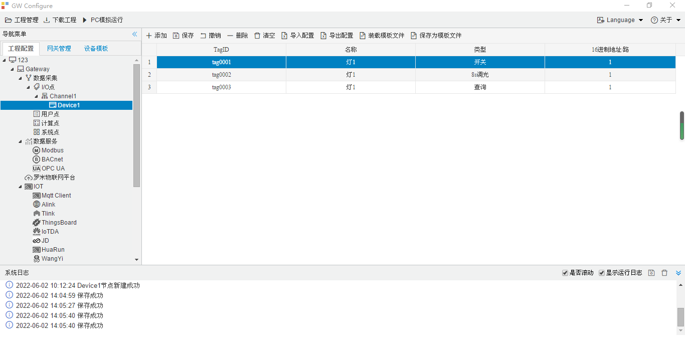

## 4.编辑采集点表

点击"Device1"，出现采集点配置界面，

- TagID：可自定义，默认为  tag0001，根据需要修改，设备采集点表内，名称不可重复；
- 名称：可自定义，描述信息，根据需要填写，可不填；
- 类型：根据需要，选择 **开关，调光，查询**选择其中之一 ；
- 16进制地址/路：可自定义，必须填写；
- 

如下图2-1-7 所示  点击"添加" 后，创建如下内容，最后点击"保存"。

​		

图2-1-7 tag点配置

#### 值含义：

- **开并：** 0表示并 ，1表示开

- **调光 ：**取值范围0-255，表示亮度（如：127表示亮度 50%），填写值超过255时会取余数（如：填写值为             257，用257除以256的余数为1）

- **查询：** 0表示关，1表示开，2表示错误，3表示不存在