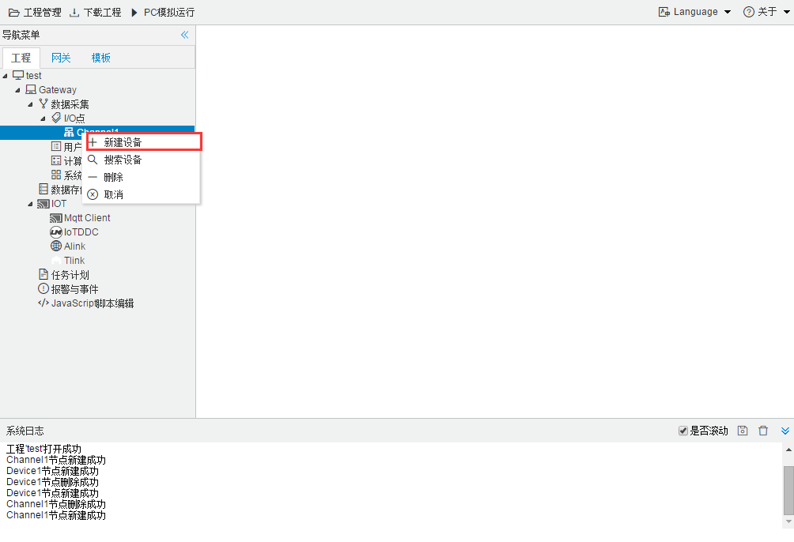
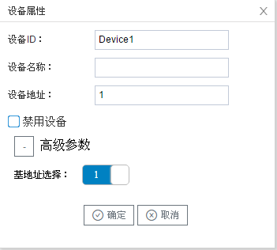

## 3.新建设备

右键"Channel1"后,如下图2-1-4所示   

图2-1-4 新建设备

点击"新建设备"，出现"设备属性""弹框。

如下图2-1-5所示

图2-1-5 设备配置

- 设备ID：可自定义，默认为"Device1"，同一通道下，设备名称不可重复。
- 设备名称：设备的真实名称，可自定义。
- 设备地址：仪表的地址。
- 基地址：默认为1。如果仪表的说明文档中，起始地址是0，可以将工程中基地址改为0，也可以将文档中的地址+1配置到工程当中
- 禁用设备：勾选后设备不起作用。

配置完成后，"Channel1"下会多出一个新增设备"Device1"，如下图所示。

