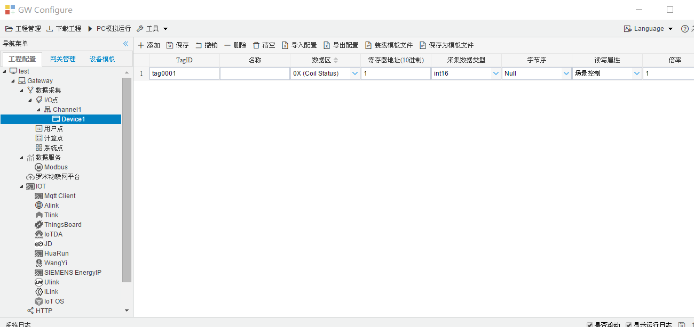

## 4.编辑采集点表

点击"Device1"，出现采集点配置界面，

- TatgID: 数据点标签，默认为tagxxx，可自定义，同一个设备TagID不可重复。

- 名称：点名称，可自定义；

- 数据区：根据需要，选择"0X (Coil Status)"、"1X (Input Status)"、"3X (Input Registers)"和"4X (Holding Register)"。

  - 0X   (Coil Status)  数字量、**支持读写**，该数据区只支持布尔量， "采集数据类型" 只能设置bool   

  - 1X (Input Status)  数字量、**只读**，该数据区只支持布尔量， "采集数据类型" 只能设置bool 

  - 3X (Input Registers) 模拟量、**只读** 

  - 4X (Holding Register) 模拟量、**支持读写**

  
  | 功能码 | 名称           | 支持数据类型                                   | 对应Modbus数据区 |
  | ------ | -------------- | ---------------------------------------------- | ---------------- |
  | 0x01   | 读线圈状态     | bool                                           | 0X               |
  | 0x02   | 读取输入状态   | bool                                           | 1X               |
  | 0x03   | 读取保持寄存器 | bit、int8、int16、int32、int64、float、double  | 4X               |
  | 0x04   | 读取输入寄存器 | bit、int8、int16、int32、int64、float、double  | 3X               |
  | 0x05   | 强置单线圈     | bool                                           | 0x               |
  | 0x06   | 预置单寄存器   | bit、int8、int16、int32、int64、float、double  | 4x               |
  | 0x0F   | 强置多线圈     | bool                                           | 0x               |
  | 0x10   | 强置多寄存器   | bit、int8、int16、int32、int64、float、double  | 4x               |

- Modbus寄存器地址：寄存器的地址，地址范围0-65535，

  - 注意取位操作时，，地址保留两位小数写成 X.XX ，bit位的操作范围00到15共16位。

    取位示例：

     地址为"1.05"，  读取寄存器地址为 1 的第6位  bit，取出的值为0；

  ​        地址为"1.12" ， 读取寄存器地址为 1 的第13位  bit，取出的值为1;

  

- 字节序：计算机体系结构中对于字节、字等的存储机制不同，所以需要对高低字节排序，用来解析数据。

  我们用1、2、3、4 对应两个寄存器中的4个字节：

  - "Big-endian"表示高地址在前   1234
  - "Little-endian"表示低地址在前 4321
  - "Big-endian byte swap"表示高地址在前，并交换字节顺序   2143
  - "Little-endian byte swap"表示低地址在前，并交换字节顺序  3412

- 读写属性：指定采集点的读写权限，一般有"读写"（可读可写）、"只读"（只能读取）和"只写"（只能写入）

- "倍率"：通过倍率对数据进行乘法运算，可进行工程上的换算，默认为1。

如下图2-1-7 所示  点击"添加" 后，创建如下内容，最后点击"保存"。

​		

图2-1-7 tag点配置

