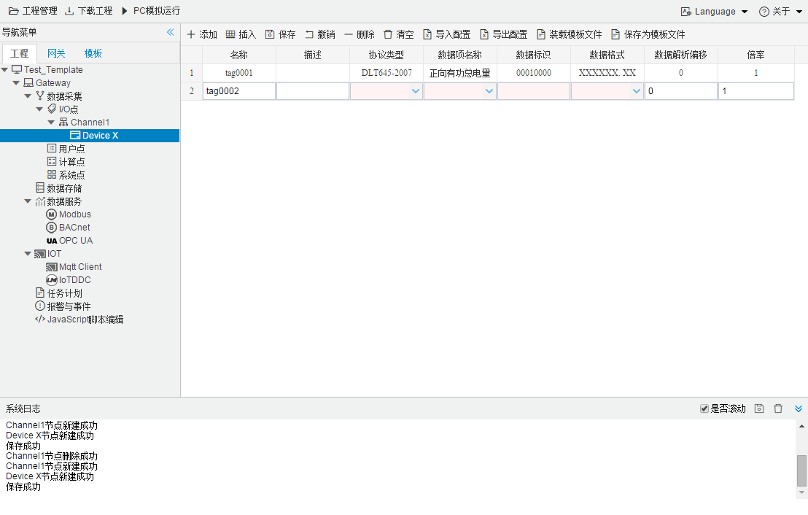

## 4.编辑采集点表

点击"Device1"，出现采集点配置界面，

- 名称：可自定义，默认为  tag0001，根据需要修改，设备采集点表内，名称不可重复；
- 描述：可自定义，描述信息，根据需要填写，可不填；
- 协议类型：根据需要选择 "DLT645-1997"或者"DLT645-2007"；
- 数据项名称：根据需要选择 ，"数据标识"和"数据格式"配置工具自动补入；
- 数据解析偏移：面对可以同时取出多个数据项的"数据标识"时，可以通过偏移再结合"数据格式"来取出需要的数据项。**除了自定义数据，请勿填写，默认为0。**
- 倍率：通过放大或者缩小数据，可进行工程上的换算。根据需要填写，默认为1。

如下图2-4-7 所示  点击"添加" 后，创建名称为"tag0001"，协议类型："DLT645-2007"；数据项采集：正向有功总电量；数据解析偏移：0，倍率：1，的任务点，最后点击"保存"。

​					

图2-4-7 tag点配置

