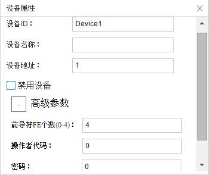

## 3.新建设备

右键"Channel1"后,如下图2-4-4所示   

图2-4-4 新建设备

点击"新建设备"，出现设备属性界面。

如下图2-4-5所示

图2-4-5  设备配置

- 设备ID：可自定义，默认为"Device1"，同一通道下，设备ID不可重复。

- 设备名称：可自定义，可不填。

- 设备地址：电表的通讯地址，也称为表号。DLT645_over_TCP标准协议定义通信地址为12位数字，**不足12位时，配置工具可在高位自动补”0“**。

  可以通过仪表前面板的条码或者显示面板获取通讯表号。

  也可以编辑该数据项读取电表地址（注意：读取表号是广播命令，总线上只能连接一台电表）。

- 高级参数
  - 前导符FE个数：在报文发送前自定义前导符的个数
  - 操作者代码：发送控制阀门命令时，操作者的代号，报文组成成分
  - 密码：发送控制阀门命令时，设备密码，报文组成成分

配置完成后，"Channel1"下会多出一个新增设备”Device1"，如下图2-4-6所示。

图2-4-6 Device1 子菜单栏

