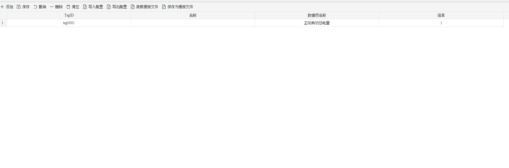

## 4.编辑采集点表

点击"Device1"，出现采集点配置界面，

- TagID：可自定义，默认为  tag0001，根据需要修改，设备采集点表内，名称不可重复；
- 名称：可自定义，描述信息，根据需要填写，可不填；
- 数据项名称：根据需要选择 ；
- 倍率：通过放大或者缩小数据，可进行工程上的换算。根据需要填写，默认为1。

如下图2-4-7 所示  点击"添加" 后，创建TagID为"tag0001"，数据项采集：正向有功总电量；倍率：1，的任务点，最后点击"保存"。

​					

图2-4-7 tag点配置

