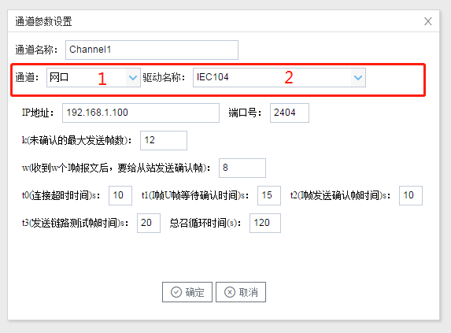

## 2.新建驱动

通道参数设置页面，在"通道"选择"网口"，在"驱动名称" 选中"IEC104"。如下图2-10-2所示

  图2-10-2 通道参数设置	

接着开始配置通道的采集信息，"IEC104"默认配置是：

- 通道名称：Channel1，可自定义，不可重复，定义网关的采集通道；
- 通道：网口和串口两个选项，该驱动选择网口；
- 驱动名称： 选中"IEC104"
- IP地址/域名：输入 IEC104的IP地址
- 端口：输入 IEC104的端口号
- k(未确认的最大发送帧数)：默认即可，或者根据实际情况填写
- w(收到w个I帧报文后，要给从站发送确认帧)： 默认即可，或者根据实际情况填写
- t0(连接超时时间)s：默认即可，或者根据实际情况填写
-  t1(I帧U帧等待确认时间)s： 默认即可，或者根据实际情况填写
-  t2(I帧发送确认帧时间)s：默认即可，或者根据实际情况填写
- t3(发送链路测试帧时间)s：默认即可，或者根据实际情况填写
-  总召循环时间(s)：默认即可，或者根据实际情况填写

 点击"确定"后，菜单栏"I/O点"下会新增通道"Channel1"，如下图2-10-3所示

 图2-10-3 Channel子菜单栏
