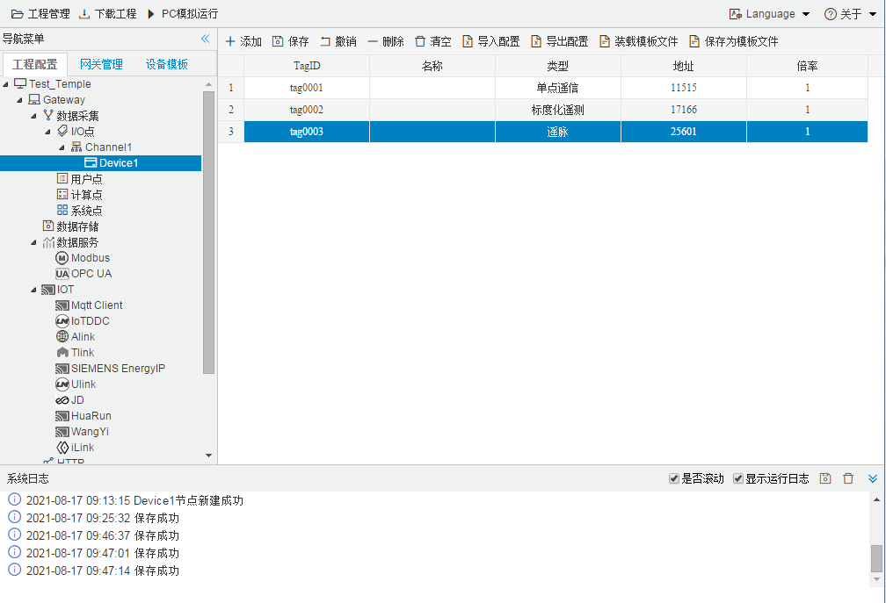

## 4.编辑采集点表

点击"Device1"，出现采集点配置界面，

- 名称：可自定义，默认为  tag0001,tag0002依次递增，根据需要修改，设备采集点表内，名称不可重复；
- 描述：可自定义，描述信息，根据需要填写，可不填；
- 类型：根据实际设备，从中选择单点遥信、双点遥信、短浮点遥测、归一化遥测、标度化遥测、遥脉；
- 地址：根据实际设备填写，如果地址是16进制，请转换成10进制后输入；
- 倍率：通过放大或者缩小数据，可进行工程上的换算。根据需要填写，默认为1；

| 序号 | 寄存器类型 |      描述（地址范围）      |
| :--: | :--------: | :------------------------: |
|  1   |  单点遥信  |    1H~4000H（1~16384）     |
|  2   |  双点遥信  |    1H~4000H（1~16384）     |
|  2   | 短浮点遥测 | 4001H~5000H（16385~20480） |
|  3   | 归一化遥测 | 4001H~5000H（16385~20480） |
|  4   | 标度化遥测 | 4001H~5000H（16385~20480） |
|  5   |    遥脉    | 6401H~6600H（25601~26112） |
|  6   |    遥控    | 6001H~6100H（24577~24832） |
|  7   |    遥调    | 6201~6400H（25089~25600）  |

如下图所示，添加“单点遥信”，“标度化遥信”，“遥脉”三个采集点，地址要在表格对应范围之内

