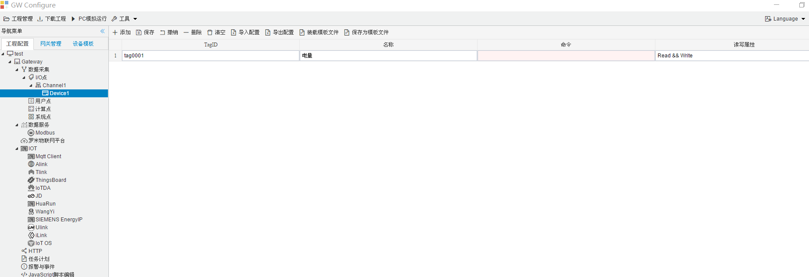

## 4.编辑采集点表

点击"Device1"，出现采集点配置界面，

- 名称：可自定义，默认为  tag0001，根据需要修改，设备采集点表内，名称不可重复；
- 描述：可自定义，描述信息，根据需要填写，可不填；
- 命令：SCPI的命令；
- 读写属性：可以选择只读、只写，读写；

如下图2-4-7 所示  点击"添加" 任务点，填写好内相关内容后点击"保存"。

​					

图2-4-7 tag点配置

