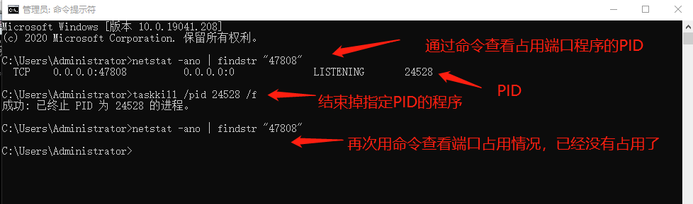

## 6.常见问题

配置工具搜索不到设备或点时，先用Yabe软件测试读取BACnetIP服务，步骤如下：

下载地址：http://www.lmgateway.com/Yabe.zip

打开Yabe软件，点击上方工具栏的绿色“+”号按钮，在弹出框中上图中的端口号(BAC0为上图中47808的16进制)、选择PC的IP地址，点击“Add”完成软件连接配置。

在Udp:47808节点下有GC中BACnet页面设备ID的设备，说明已经连接上LMGateway的BACnet IP服务，单击此设备节点，就会在左侧中部显示搜索到的所有此设备映射出的BACnet设备和对象。

点击每一个对象，就会显示该对象的所有属性。

**用Yabe软件能搜索正常，用配置工具搜索不到设备或点**

　　原因是47808端口被占用了，解决方法：打开"CMD"窗口，输入 netstat -ano | findstr "47808" 命令来查看占用端口程序的PID，然后通过 taskkill /pid （占用程序的PID放这里） /f  命令来结束掉指定PID程序，完成后可以再次用netstat命令查看端口占用情况，这时可以看到已经没有程序占用端口了。

　　解决掉端口占用问题后，就可以正常搜索到点了。