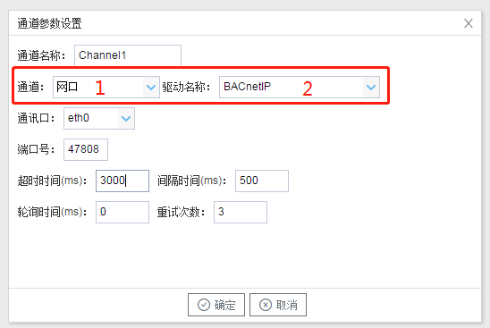

## 2.新建驱动

通道参数设置页面，在"通道"选择"网口"，在"驱动名称" 选中"BACnetIP"。如下图2-1-2所示

  图2-1-2 通道参数设置	

接着开始配置通道的采集信息，"BACnetIP"默认配置是：

- 通道名称：Channel1，可自定义，不可重复，定义网关的采集通道；
- 通道：网口和串口两个选项，该驱动选择网口；
- 驱动名称： 选中"BACnetIP"
- 通讯口：填写与仪表连接的网口，默认为"eth0"；
- 端口号：仪表的端口号，默认为47808；
- 超时时间：即为APDU超时时间。可自定义，默认3000ms；
- 间隔时间：可自定义，默认500ms;
- 轮询时间：可自定义，默认为0ms；
- 重试次数：即为APDU重试次数。可自定义，默认为3；

点击"确定"后，菜单栏"I/O点"下会新增通道"Channel1"，如下图2-1-3所示

 图2-1-3 Channel子菜单栏
