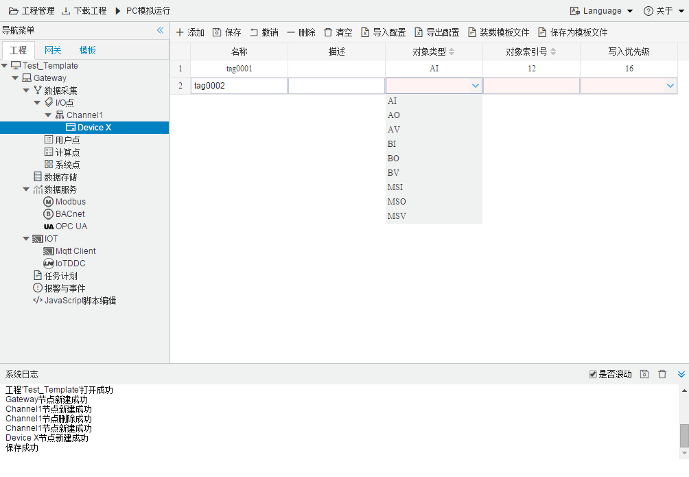

## 4.编辑采集点表

点击"Device1"，出现采集点配置界面，

- 名称：可自定义，默认为  tag0001，根据需要修改，设备采集点表内，名称不可重复；
- 描述：可自定义，描述信息，根据需要填写，可不填；
- 对象类型：根据需要，选择 **AI、AO、AV 、BI、BO、BV、MSI、MSO、MSV**选择其中之一 ；
- 对象索引号：可自定义，必须填写；
- 写入优先级：根据需要，选择需要的写入优先级。等级范围  1,2,3..,16；其中16 级别最低，1 级别最高；

如下图2-1-7 所示  点击"添加" 后，创建名称为"tag0001"，"对象类型"："AI"；"对象索引号"："12"；"写入优先级"："16"的任务点最后点击"保存"。

​		

图2-1-7 tag点配置

