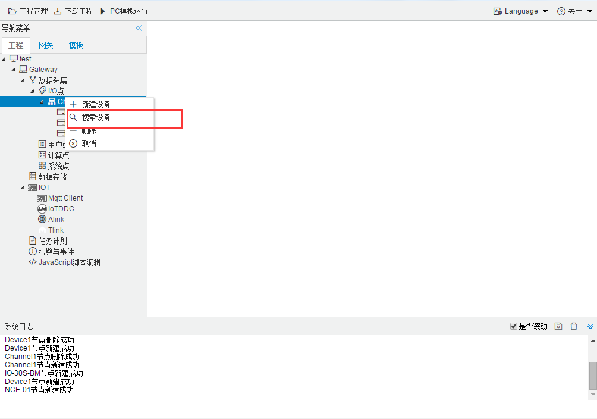
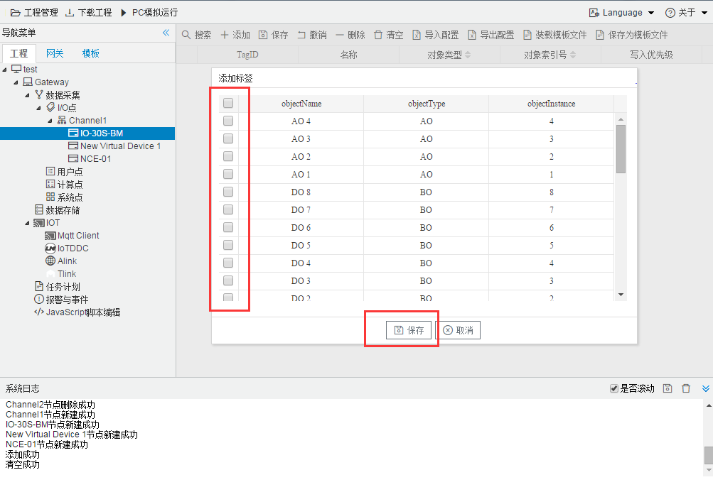

## 5.搜索功能

1. 搜索设备

   

   
图2-2-12 搜索设备

   点击"搜索设备"后，会跳出弹框显示所有在线的设备。

   

   
图2-2-13 在线设备

   选中需要添加的设备之后，点击"确定"即可完后添加设备

2. 搜索采集点

   

图2-2-14 搜索采集点

点击"搜索"后，会跳出弹框显示所有在线的可采集的tag点；

图2-2-15 在线采集点

选中需要添加的采集点之后，点击"确定"即可完后添加设备

**注意：使用"搜索设备"时，当前通道采集参数 为当前计算机与BACnetMSTP 设备所连接的参数，一定要在将工程下载到网关设备之前，修改成网关设备可识别的参数 例如，"串口"修改成"com1"。**

图2-2-16 修改通讯口

