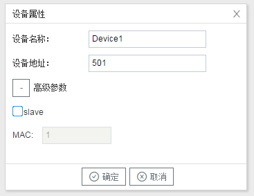

## 3.新建设备

右键"Channel1"后,如下图2-2-4所示   

图2-2-4 新建设备

点击"新建设备"，出现设备属性界面。

如下图2-2-5所示

图2-2-5  设备配置

- 设备名称：可自定义，默认为"Device1"，同一通道下，设备名称不可重复。

- 设备地址：：即为设备号，可自定义。（可以通过Yabe 等软件读出设备号）。

- 高级参数：可选择启用或者不启用。若选择启用，勾选"slave"选项，开始编辑"MAC"地址。 范围0-255。

  当BACnet的设备作为从站时，无法通过主站的令牌交互来通信，所以直接设置从站的MAC地址，就可以直接通过MAC地址与从站进行通信。但设备为主站时可填可不填，**从站必须要填**。

配置完成后，"Channel1"下会多出一个新增设备”Device1“，如下图2-2-6所示。

图2-2-6 Device1 子菜单栏

