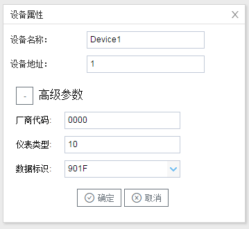

## 3.新建设备

右键"Channel1"后,如下图2-3-4所示   

图2-3-4 新建设备

点击"新建设备"，出现设备属性弹框。

如下图2-3-5所示

图2-3-5  设备配置

- "设备名称"：可自定义，默认为"Device1"，同一通道下，设备名称不可重复。
- "设备地址"：水表的通讯地址，也称为表号。水表的标准协议定义通信地址为10位数字，**不足10位时，配置工具可在高位自动补”0“**。
- 厂商代码：由4位数字组成，是水表厂商的代号，联系厂家即可获得；
- 仪表类型：根据需要选择仪表的类型填入 相应的数字

对应关系如下

| 仪表             | 代码 |
| ---------------- | ---- |
| 冷水水表         | 10   |
| 生活热水水表     | 11   |
| 直饮水水表       | 12   |
| 中水水表         | 13   |
| 热量表（计热量） | 20   |
| 热量表（计冷量） | 21   |

- 数据标识 ：部分水表协议是 1F90 ，符合 CJ188-2004协议   默认 901F即可 

配置完成后，"Channel1"下会多出一个新增设备"Device1"，如下图2-3-6所示。

图2-3-6 Device1 子菜单栏

