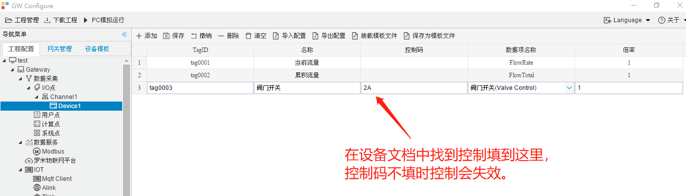
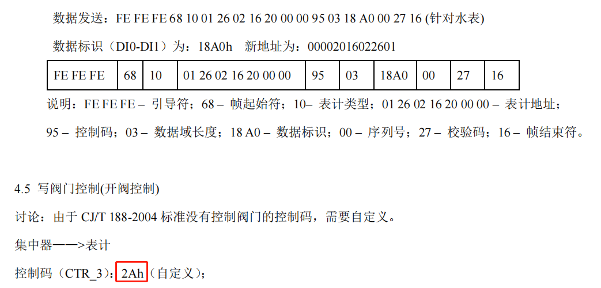

## 4.编辑采集点表

点击"Device1"，出现采集点配置界面，

- 名称：可自定义，默认为  tag0001，根据需要修改，设备采集点表内，名称不可重复；
- 描述：可自定义，描述信息，根据需要填写，可不填；
- 控制码：任务点数据项名称为“阀门开关”时，需要填写控制码，否则控制会失效;
- 数据项名称：根据需要选择 当前流量和累积流量；
  - 当前流量：仅仅只有热量表可以获取数据，其他类型的表 获得值为“0.00”
  - 累积流量：所有类型的表都可以获得数据
  - 阀门开关：获取和控制设备的阀门开关状态
- 倍率：通过放大或者缩小数据，可进行工程上的换算。根据需要填写，默认为1。

如下图2-3-7 所示  点击"添加" 后，创建任务点，最后点击"保存"。

图2-3-7 tag点配置

下图为示例设备的文档，在其中可以看到控制码为：2Ah（其中h是指的是16进制），控制码只需填前2位即：2A

