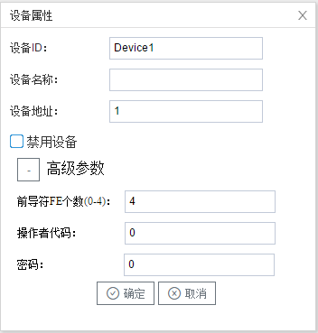

## 3.新建设备

右键"Channel1"后,如下图2-4-4所示   

图2-4-4 新建设备

点击"新建设备"，出现设备属性界面。

如下图2-4-5所示

图2-4-5  设备配置

- 设备ID：可自定义，默认为"Device1"，同一通道下，设备ID不可重复。

- 设备名称：可自定义，可不填。

- 设备地址：电表的通讯地址，也称为表号。DLT645标准协议定义通信地址为12位数字，**不足12位时，配置工具可在高位自动补”0“**。

  可以通过仪表前面板的条码或者显示面板获取通讯表号，也可以通过通讯指令读取表号（注意：读取表号是广播命令，总线上只能连接一台电表）。

  97协议，通过串口工具发送16进制：fe fe fe 68 99 99 99 99 99 99 68 01 02 43 c3 6f 16

  07协议，通过串口工具发送16进制：fe fe fe 68 aa aa aa aa aa aa 68 11 04 33 33 34 33 ae 16

  返回的报文中，68和68之间的6个字节，举例：“ 03 27 12 00 01 12 ”倒序组合成 “120100122703” 就是该电表完整的12位地址。

  新版本的配置工具软件，数据项增加了读地址，也可以编辑该数据项读取电表地址。

- 高级参数
  - 前导符FE个数：在报文发送前自定义前导符的个数
  - 操作者代码：发送控制阀门命令时，操作者的代号，报文组成成分
  - 密码：发送控制阀门命令时，设备密码，报文组成成分

配置完成后，"Channel1"下会多出一个新增设备”Device1"，如下图2-4-6所示。

图2-4-6 Device1 子菜单栏

