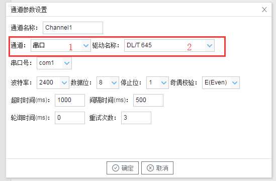

## 2.新建驱动

通道参数设置页面，在"通道"选择"串口"，在"驱动名称" 选中"DL/T 645"。如下图2-4-2所示

  图2-4-2 通道参数设置	

接着开始配置通道的采集信息，"DL/T 645"默认配置是：

- 通道名称：Channel1，可自定义，不可重复，定义网关的采集通道；
- 通道：网口和串口两个选项，该驱动选择串口；
- 驱动名称： 选中"DL/T 645"
- 串口号：选择网关连接仪表的 com 口；
- 串口参数：与被采集仪表保持一致。采集默认参数为：波特率：2400bps；
- 超时时间：自定义，默认1000ms； 
- 间隔时间：可自定义，默认500ms；
- 轮询时间：可自定义，默认为0ms；
- 重试次数：可自定义，默认为3；

点击"确定"后，菜单栏"I/O点"下会新增通道"Channel1"，如下图2-4-3所示

 图2-4-3 Channel子菜单栏
