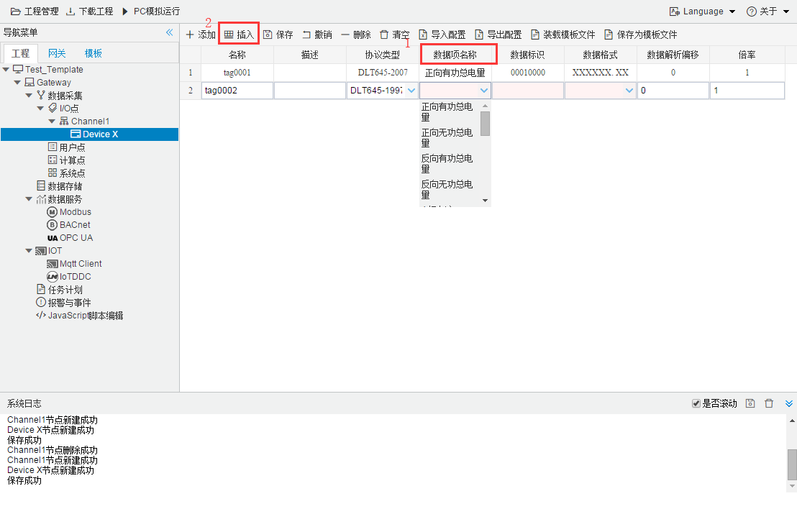

## 7.自定义数据采集点

如果"数据项名称"中的采集项中无法找到需要的采集项，可以在上方的工具栏中找到"插入"，如下图2-4-12所示。

图2-4-12 插入功能

点击"插入",出现如图2-3-13所示

图2-4-13  插入界面

- 名称：可自定义，默认为  tag0001，根据需要修改，设备采集点表内，名称不可重复；

- 描述：可自定义，描述信息，根据需要填写，可不填；

- 协议类型：根据需要选择 “DLT645-1997”或者“DLT645-2007”；

- 数据项名称：采集的数据项名称 (可自定义，**必填**)；

- 数据标识：97 或者07协议中的数据标识；

- 数据格式：97 或者07协议中的数据格式；

- 数据解析偏移：面对可以同时取出多个数据项的 "数据标识" 时，可以通过偏移再结合 "数据格式" 来取出需要的数据项。

- 倍率：通过放大或者缩小数据可进行工程上的换算。根据需要填写，默认为1。

  点击"确定"特殊任务点添加完毕。如下图 2-4-14所示

  

  

  
图2-4-14	自定义数据采集点

  

  

