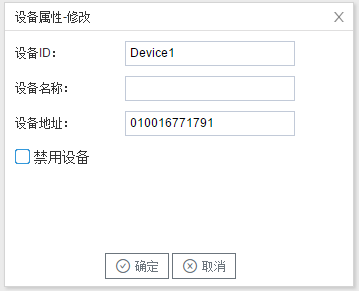

## 3.新建设备

右键"Channel1"后,如下图2-4-4所示   

图2-4-4 新建设备

点击"新建设备"，出现设备属性界面。

如下图2-4-5所示

图2-4-5  设备配置

- 设备名称：可自定义，默认为"Device1"，同一通道下，设备名称不可重复。

- 设备地址：电表的通讯地址，也称为表号。**如果设备地址未填入正确的表号，电表不会给网关发送回复报文。**

  可以通过仪表前面板的条码或者显示面板获取通讯表号，也可以通过通讯指令读取表号（注意：读取表号是广播命令，总线上只能连接一台电表）。

  Tx: FE FE FE FE 68 17 00 43 45 AA AA AA AA AA AA 11 53 4E 05 01 01 40 01 02 00 00 C6 07 16 
Rx: FE FE FE FE 68 21 00 C3 05 91 17 77 16 00 01 11 B9 9C 85 01 01 40 01 02 00 01 09 06 01 00 16 77 17 91 00 00 B5 10 16 
  
返回报文中01 00 16 77 17 91就是表号。
  
配置工具软件，数据项提供了读电表地址，也可以编辑该数据项读取电表地址。

配置完成后，"Channel1"下会多出一个新增设备”Device1"，如下图2-4-6所示。

图2-4-6 Device1 子菜单栏

