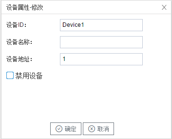

## 3.新建设备

右键"Channel1"后,如下图2-11-4所示   

图2-11-4 新建设备

点击"新建设备"，出现"设备属性""弹框。

如下图2-10-5所示

图2-11-5 设备配置

- "设备ID"：可自定义，默认为"Device1"，同一通道下，设备ID不可重复。
- "设备名称"：可自定义，可不填。
- "公共地址"：输入设备的公共地址

配置完成后，"Channel1"下会多出一个新增设备"Device1"，如下图2-10-6所示。

图2-11-6 Device1 子菜单栏

