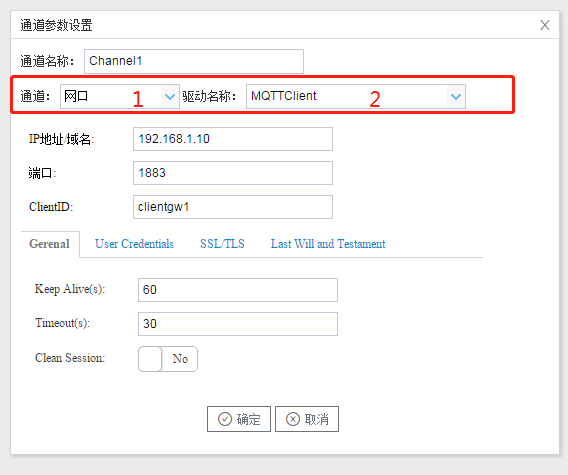
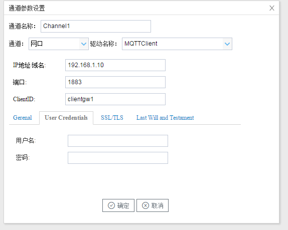
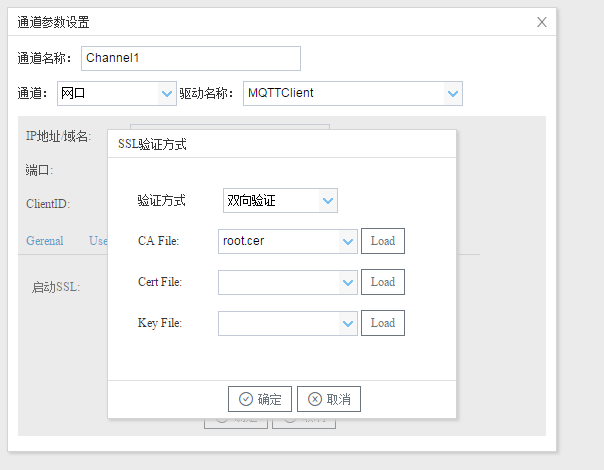
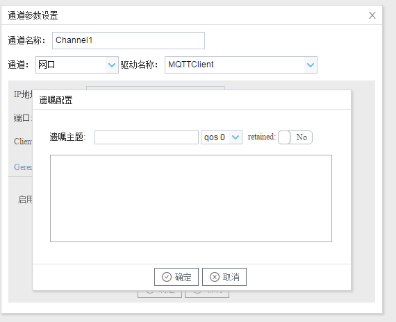

## 2.新建驱动

通道参数设置页面，在"通道"选择"网口"，在"驱动名称" 选中"MQTTClient"。如下图2-10-2所示

  图2-10-2 通道参数设置	

接着开始配置通道的采集信息，"MQTTClient"默认配置是：

- 通道名称：Channel1，可自定义，不可重复，定义网关的采集通道；
- 通道：网口和串口两个选项，该驱动选择网口；
- 驱动名称： 选中"MQTTClient"
- IP地址/域名：输入 MQTTServer的IP地址或者域名
- 端口：输入 MQTTServer的端口号
- ClientID：客户端唯一标识，不可重复。

"Gerenal":基本设置

- Keep Alive(s) :心跳，客户端在Connect的时候设置Keep Alive时长。默认60s。

- Timeout(s) :定义客户端发送信息到云端响应的最大时间间隔。默认30s。

- Clean Session：NO-开启会话重用机制，恢复之前的Session信息。

  ​							 YES-关闭会话重用机制，每次Connect都是一个新Session。

"User Credentials"  用户验证

- 用户名：据broker的配置，输入连接时登陆的用户名
- 密码：据broker的配置，输入连接时登陆的密码

"SSL/TLS"  通信加密

- 验证方式：单向验证-需要上传CA File到网关。CA File由云服务商提供。

  ​					双向验证-需要上传CA文件，Cert File、Key File到网关。Cert File、Key File由云服务商提供。

Last Will and  Testment 遗嘱配置

- 遗嘱主题：当网络连接断开时，客户端根据主题发布消息。
- 服务质量：qos 0、qos 1、qos 2 根据需求选择
- retained：默认为No。No-仅仅为当前订阅者推送消息；Yes-发送的消息要一直保存，还发送给所有订阅这个主题的订阅者。
- 遗嘱内容：发送的信息。

 点击"确定"后，菜单栏"I/O点"下会新增通道"Channel1"，如下图2-10-3所示

 图2-10-3 Channel子菜单栏
